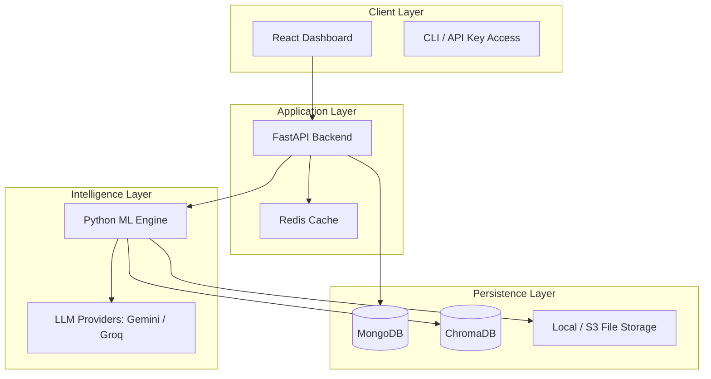
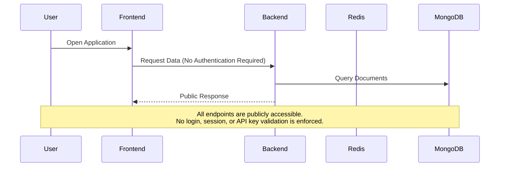

# ScholarAI — Advanced Research Assistant System

[](https://github.com/OrionGD/ScholarAI)
[](LICENSE)
[](https://github.com/OrionGD/ScholarAI)
[](https://react.dev/)
[](https://www.typescriptlang.org/)
[](https://www.python.org/)
[](https://fastapi.tiangolo.com/)
[](https://www.mongodb.com/)
[](https://redis.io/)
[](https://www.trychroma.com/)
[](https://huggingface.co/sentence-transformers)
[](https://tailwindcss.com/)
[](https://vitejs.dev/)
[](https://groq.com/)
[](https://deepmind.google/technologies/gemini/)
[](https://github.com/OrionGD/ScholarAI)
[](https://github.com/OrionGD/ScholarAI)

> **Production-grade Retrieval-Augmented Generation (RAG) platform for academic research and institutional knowledge management.**

---

## 📑 Table of Contents

1. [Document Conventions](#document-conventions)
2. [Executive Summary](#executive-summary)
3. [Solution Positioning](#solution-positioning)
4. [Problem Statement](#problem-statement)
5. [Core Capabilities](#core-capabilities)
6. [Technology Stack](#technology-stack)
7. [System Architecture](#system-architecture)
8. [API Overview](#api-overview)
9. [Setup and Installation](#setup-and-installation)
10. [Configuration Management](#configuration-management)
11. [Quality Assurance Framework](#quality-assurance-framework)
12. [Security, Privacy, and Compliance](#security-privacy--compliance)
13. [Operational Excellence](#operational-excellence)
14. [Performance Benchmarks](#performance-benchmarks)
15. [Runbooks and Troubleshooting](#runbooks-and-troubleshooting)
16. [Project Roadmap](#project-roadmap)
17. [Contribution Guidelines](#contribution-guidelines)
18. [Project File Structure](#project-file-structure)
19. [Glossary](#glossary)
20. [License and Acknowledgments](#license-and-acknowledgments)
21. [Documentation Map](#documentation-map)

---

## Document Conventions

### Acronyms and Abbreviations

| Acronym | Definition |
| :--- | :--- |
| RAG | Retrieval-Augmented Generation |
| LLM | Large Language Model |
| API | Application Programming Interface |
| CI/CD | Continuous Integration / Continuous Deployment |
| SLA | Service Level Agreement |
| SLO | Service Level Objective |
| OCR | Optical Character Recognition |
| CORS | Cross-Origin Resource Sharing |
| JWT | JSON Web Token |

## Executive Summary

ScholarAI (Advanced Research Assistant System) is a production-grade academic research platform designed to transform how scholars, research institutions, and knowledge-driven organizations process, analyze, and synthesize academic literature. By integrating state-of-the-art Large Language Models with high-performance vector search, ScholarAI converts static document libraries into dynamic, queryable knowledge ecosystems.

The platform is architected as a modular, microservices-oriented system where each layer — from the Python-based machine learning engine to the React frontend — scales independently. At its core, ScholarAI implements a RAG pipeline that grounds all AI-generated insights in the user's document library, drastically reducing hallucination risk and providing verifiable citations for every claim.

### Key Value Propositions

| Stakeholder | Value Delivered |
| :--- | :--- |
| **Individual Researchers** | Reduce literature review time by up to 70% through semantic search and automated synthesis. |
| **Research Institutions** | Centralize institutional knowledge, enable cross-departmental discovery, and preserve research continuity. |
| **Publishers and Libraries** | Enhance content discoverability and provide AI-powered reading assistance to subscribers. |
| **Enterprise R&D Teams** | Build private knowledge bases from internal reports, patents, and technical documentation. |

### Current Release Status

- **Version:** 2.1.3
- **License:** MIT
- **Access Model:** Open-Access (no authentication required)
- **Deployment Modes:** Local development, Docker containerization, cloud-native distributed

---

## Solution Positioning

### Competitive Differentiation

| Capability | ScholarAI | Traditional Search | Generic LLM Chatbots |
| :--- | :--- | :--- | :--- |
| **Source Grounding** | Every response cites specific documents and page numbers | Citation lists only; no contextual grounding | No source verification; high hallucination risk |
| **Semantic Retrieval** | Cross-terminology matching via vector embeddings | Exact keyword dependency | No document-specific retrieval |
| **Multi-Format Ingestion** | PDF, URL, and raw text with OCR readiness | Format-dependent; often PDF-only | Typically text-paste only |
| **Institutional Scalability** | Microservices architecture with independent scaling | Monolithic or vendor-locked | Consumer-grade; no enterprise controls |
| **Data Sovereignty** | Self-hostable with local embedding models | Cloud-dependent | Third-party data exposure |

### Target Use Cases

1. **Literature Review Automation**
   Ingest hundreds of papers and extract methodologies, findings, and gaps through natural language queries rather than manual reading.

2. **Cross-Paper Synthesis**
   Identify connections, contradictions, and research trajectories across disparate publications using comparative analysis tools.

3. **Institutional Knowledge Base**
   Transform an organization's accumulated research into a searchable, conversational asset that persists beyond individual tenures.

4. **Regulatory and Compliance Research**
   Rapidly locate specific clauses, precedents, or evidentiary passages within large corpora of legal or regulatory documents.

---

## Problem Statement

### The Information Overload Crisis

The volume of academic literature doubles approximately every few years across major scientific disciplines. For individual researchers and institutions alike, maintaining currency through traditional methods is no longer merely difficult — it is mathematically infeasible.

### Identified Workflow Inefficiencies

1. **Semantic Retrieval Gap**
   Keyword-based search engines (e.g., Google Scholar) fail to bridge terminological divergence. A query for "Deep Learning" will miss semantically identical work labeled "Neural Networks" or "Representation Learning."

2. **Cognitive Load Burden**
   Extracting methodology and key findings from a 30-page paper requires significant mental effort and consumes hours of highly skilled researcher time.

3. **Knowledge Fragmentation**
   Insights remain trapped in individual PDFs, preventing the synthesis of cross-cutting themes and the identification of emergent research trends.

4. **Verification Overhead**
   Manually validating AI-generated summaries against source text is tedious, error-prone, and often neglected — leading to unchecked propagation of inaccuracies.

---

## Core Capabilities

### Capability Matrix

| Capability | Description | Technical Enabler |
| :--- | :--- | :--- |
| **Intelligent Document Ingestion** | Handles PDFs, URLs, and raw text with automatic metadata extraction (topics, keywords, summaries, reading time). | `pypdf`, `pymupdf`, `beautifulsoup4`, Gemini Analytics API |
| **OCR Infrastructure** | Ready pipeline for scanned documents using `pdf2image` and `pytesseract` integration. | pdf2image, pytesseract |
| **Semantic Chunking** | Recursive character splitting (default 1000 characters, 200 overlap) that respects paragraph boundaries for coherent retrieval units. | `langchain-text-splitters` |
| **Semantic Search Engine** | Converts documents to 384-dimensional (local) or 768-dimensional (remote) vectors for cosine-similarity retrieval across terminological variations. | `sentence-transformers`, ChromaDB |
| **RAG Chat Interface** | Conversational querying with document-specific or general scope, streaming responses via Server-Sent Events, and inline source citations. | Groq LLM, custom RAG pipeline |
| **Comparative Analysis** | Multi-document comparison for similarity detection, divergence analysis, and research gap identification. | Gemini Analysis API, custom synthesis logic |
| **Real-Time Streaming UI** | Token-by-token response streaming with source highlighting and relevance scoring. | Server-Sent Events, React 19 |

---

## Technology Stack

### Layered Component Matrix

| Layer | Technology | Version | Purpose |
| :--- | :--- | :--- | :--- |
| **Frontend Framework** | React | 19.2.4 | Component-based user interface |
| **Frontend Language** | TypeScript | 5.8.2 | Type-safe development |
| **Build Tool** | Vite | 8.0.8 | Optimized development and production builds |
| **Frontend Language** | TypeScript | 5.8.2 | Type-safe development |
| **Build Tool** | Vite | 8.0.8 | Optimized development and production builds |
| **Styling** | Tailwind CSS | 4.2.1 | Utility-first responsive design system |
| **State Management** | Zustand | 5.0.11 | Global application state |
| **Server State** | TanStack Query | 5.90.21 | Asynchronous server state synchronization |
| **Animations** | Framer Motion | 12.36.0 | Premium UI transitions |
| **Development Server** | Express | 5.2.1 | Hot reloading and API proxying |
| **Backend Runtime** | Python | 3.11+ | High-performance ML and API services |
| **API Framework** | FastAPI | Latest | Asynchronous REST endpoints |
| **ASGI Server** | Uvicorn | Latest | Production-grade HTTP serving |
| **Metadata Database** | MongoDB | 6.0+ | Flexible document-oriented storage |
| **Async MongoDB Driver** | Motor | Latest | Non-blocking database operations |
| **Vector Database** | ChromaDB | Latest | Embedding storage and similarity search |
| **Caching Layer** | Redis | 7.0+ | High-speed caching and state persistence |
| **Local Embeddings** | sentence-transformers | Latest | On-premise embedding generation |
| **Remote Embeddings** | Gemini API | gemini-embedding-2-preview | High-dimension cloud embeddings |
| **Chat LLM** | Groq API | llama-3.1-8b-instant | Conversational response generation |
| **Analysis LLM** | Gemini API | Latest | Document analytics and synthesis |
| **Validation** | Pydantic / Pydantic-Settings | Latest | Schema validation and settings management |
| **Logging** | structlog | Latest | Structured, queryable logs |
| **HTTP Client** | httpx | Latest | Async HTTP requests |

For detailed dependency specifications, refer to `backend/requirements.txt` and `frontend/package.json`.

---

## System Architecture

### Microservices Orchestration

The platform is organized into three primary services communicating via RESTful APIs and asynchronous workers.



### Open-Access Request Flow



### Deployment Topologies

| Topology | Description | Ideal For |
| :--- | :--- | :--- |
| **Single-Node** | All services (backend, frontend, MongoDB, Redis, ChromaDB) run on one host. | Development, proofs-of-concept, small teams |
| **Containerized** | Docker-compose or Kubernetes orchestration with service isolation. | Staging, small-to-medium production deployments |
| **Distributed** | Managed MongoDB Atlas, hosted Redis, separate ML worker nodes, load-balanced API tier. | Enterprise production, high availability requirements |

For infrastructure-as-code examples and detailed deployment procedures, see [PRODUCTION_README.md](./PRODUCTION_README.md).

---

## API Overview

ScholarAI exposes a comprehensive REST API organized into logical domains. All endpoints are publicly accessible in the current open-access release; no authentication headers or API keys are required.

### API Domain Summary

| Domain | Description | Deep Reference |
| :--- | :--- | :--- |
| **API Keys** | Generate and revoke programmatic access keys (storage only; not enforced). | [API_DOCUMENTATION.md](./API_DOCUMENTATION.md#api-keys-api) |
| **Document Management** | Upload, process, list, view, download, analyze, and delete documents. Supports PDF, URL, and raw text ingestion. | [API_DOCUMENTATION.md](./API_DOCUMENTATION.md#document-management-api) |
| **Chat and Context** | Conversational querying with optional document scoping, streaming responses, and historical retrieval. | [API_DOCUMENTATION.md](./API_DOCUMENTATION.md#chat--context-api) |
| **Analysis** | Trigger and retrieve AI-generated document analytics including summaries, keywords, topics, and comparative reports. | [API_DOCUMENTATION.md](./API_DOCUMENTATION.md#analysis-api) |
| **Search** | Semantic vector search across the document library with filtering, pagination, and relevance scoring. | [API_DOCUMENTATION.md](./API_DOCUMENTATION.md#search-api) |
| **Support** | General AI assistance endpoint for platform help and guidance. | [API_DOCUMENTATION.md](./API_DOCUMENTATION.md#support-api) |
| **Health** | Service liveness and readiness checks for monitoring and load balancers. | [API_DOCUMENTATION.md](./API_DOCUMENTATION.md#health--status) |

### Interactive Documentation

When the backend is running, interactive Swagger UI documentation is available at:
```
http://localhost:2022/docs
```

---

## Setup and Installation

### Quick Start

For the minimal path from clone to running system, follow [QUICKSTART.md](./QUICKSTART.md). Typical local startup time is under 5 minutes on standard developer hardware.

### Enterprise Deployment

Production deployments should address the following checklist before serving live traffic:

| Checklist Item | Requirement |
| :--- | :--- |
| **Infrastructure** | Provision MongoDB (local or Atlas), Redis, and ChromaDB persistent storage. |
| **Environment Configuration** | Create `.env` files for all services with production API keys and connection strings. |
| **TLS Termination** | Configure HTTPS at the reverse proxy or load balancer layer. |
| **CORS Policy** | Restrict `ALLOWED_ORIGINS` to known production domains. |
| **Backup Strategy** | Implement automated backups for MongoDB and ChromaDB volumes. |
| **Monitoring** | Deploy health check probes and structured log aggregation. |
| **Scaling Plan** | Size compute resources based on expected document volume and concurrent query load. |

For OS-specific installation commands, Docker Compose manifests, and environment-specific tuning, refer to [PRODUCTION_README.md](./PRODUCTION_README.md).

---

## Configuration Management

### Configuration Categories

ScholarAI configuration is managed through environment variables. The following categories govern platform behavior:

| Category | Key Variables | Purpose |
| :--- | :--- | :--- |
| **Database** | `MONGODB_URI`, `DATABASE_NAME`, `REDIS_URL` | Connection strings for metadata and caching layers |
| **AI Services** | `GEMINI_API_KEY`, `GROQ_API_KEY`, `HF_TOKEN` | Authentication for embedding, analysis, and chat providers |
| **ML Tuning** | `ENABLE_REMOTE_EMBEDDINGS`, `LOCAL_EMBEDDING_MODEL`, `GEMINI_EMBEDDING_MODEL` | Toggle between local and cloud embedding pipelines |
| **Chunking** | `CHUNK_SIZE`, `CHUNK_OVERLAP` | Control text segmentation granularity |
| **Server** | `PORT`, `ENVIRONMENT`, `ALLOWED_ORIGINS` | HTTP binding, runtime mode, and CORS policy |

### Configuration Governance

- **Secrets Management:** API keys and database credentials must be injected via environment variables or a secrets manager (e.g., HashiCorp Vault, AWS Secrets Manager). Never commit credentials to version control.
- **Environment Isolation:** Maintain separate `.env` files for `development`, `staging`, and `production` environments.
- **Validation:** The backend uses Pydantic-Settings to validate configuration at startup. Missing required variables will prevent service initialization.

For the complete variable reference and example `.env` files, see [PRODUCTION_README.md](./PRODUCTION_README.md#configuration).

---

## Quality Assurance Framework

### Testing Philosophy

ScholarAI follows a shift-left quality strategy where verification is integrated at every stage of the development pipeline. The goal is to detect defects before they reach production, reducing remediation cost and ensuring platform reliability.

### Test Pyramid

| Level | Tools | Scope | Target Coverage |
| :--- | :--- | :--- | :--- |
| **Unit** | Pytest, Jest | Individual functions, Pydantic models, utility modules | >= 80% |
| **Integration** | SuperTest, `test_endpoints.py` | API endpoint behavior, service-to-service communication | Critical paths |
| **Performance** | K6 (planned) | Load testing, latency validation under concurrent demand | Baseline + 2x headroom |
| **End-to-End** | Manual, Cypress (planned) | Full user workflows from upload to chat response | Core journeys |

### Test Execution

```bash
# Backend unit and integration tests
cd backend && pytest

# Frontend linting and type checking
cd ../frontend && npm run lint

# Endpoint integration validation
cd ../scripts && python test_endpoints.py
```

---

## Security, Privacy, and Compliance

### Open-Access Platform Notice

ScholarAI version 2.1.3 operates as a fully open-access platform. The following characteristics are by design for the current release:

- **No Authentication:** There is no login, registration, or session management.
- **Public Data:** All uploaded documents, chat histories, and analyses are accessible to any user.
- **No API Key Enforcement:** API keys can be generated but are not validated on incoming requests.
- **No User Isolation:** All users share a single document library and data namespace.

### Production Hardening Roadmap

Organizations deploying ScholarAI in production environments should implement the following controls:

| Control | Current State | Target State | Priority |
| :--- | :--- | :--- | :--- |
| **Authentication** | Not implemented | JWT or OAuth 2.0 with role-based access control | Critical |
| **User Isolation** | Shared namespace | Per-user or per-tenant document libraries | Critical |
| **API Key Enforcement** | Storage only | Validation required on all programmatic endpoints | High |
| **Encryption at Rest** | Plaintext | AES-256 for MongoDB and ChromaDB volumes | High |
| **Encryption in Transit** | HTTP default | TLS 1.3 termination on all external interfaces | Critical |
| **Audit Logging** | Application logs only | Immutable audit trail for data access and modifications | Medium |
| **Rate Limiting** | None | Per-user and per-IP request throttling | Medium |
| **Input Sanitization** | Basic Pydantic validation | Advanced content scanning and injection prevention | Medium |

### AI Ethics and Responsible Use

- **Grounded Generation:** The RAG pipeline restricts LLM responses to retrieved document context, with explicit instructions to abstain when evidence is insufficient.
- **Source Attribution:** Every generated response includes citations linking to the originating document and approximate page location.
- **Data Retention:** Uploaded documents persist until explicitly deleted by an administrator. No document content is transmitted to AI providers for model training.

---

## Operational Excellence

### Monitoring and Observability

| Component | Mechanism | Endpoint / Location |
| :--- | :--- | :--- |
| **Health Checks** | HTTP liveness probe | `GET /health` |
| **Structured Logging** | JSON-formatted logs via structlog | stdout / log aggregation pipeline |
| **API Metrics** | FastAPI automatic instrumentation | `/docs` OpenAPI spec |
| **Error Tracking** | Application exception handlers | Log streams with trace IDs |

### Backup and Disaster Recovery

| Data Store | Backup Strategy | Recovery Objective |
| :--- | :--- | :--- |
| **MongoDB** | Native dump or managed service snapshots | Point-in-time recovery recommended |
| **ChromaDB** | Volume snapshots or periodic collection exports | Daily snapshots for active libraries |
| **Redis** | RDB snapshots or AOF persistence | Cache rebuild acceptable; stateless design |
| **File Storage** | Object versioning (S3) or filesystem backups | Immediate for uploaded PDFs |

### Service Level Objectives

*Targets assume standard cloud infrastructure (2 vCPU, 4 GB RAM) and local embedding mode.*

| Indicator | SLO Target | Measurement |
| :--- | :--- | :--- |
| **API Uptime** | 99.9% | `GET /health` availability over 30 days |
| **Semantic Search Latency (p95)** | < 300 ms | End-to-end query time for 1,000-document library |
| **RAG First Token Latency (p95)** | < 1,000 ms | Time to first streamed token after query submission |
| **PDF Processing (10 pages, p95)** | < 5,000 ms | Ingestion pipeline from upload to indexed embeddings |

---

## Performance Benchmarks

### Measured Latencies

*Benchmarks captured on standard cloud infrastructure (2 vCPU, 4 GB RAM) using local embedding generation.*

| Action | Latency (p50) | Latency (p95) | Notes |
| :--- | :--- | :--- | :--- |
| Semantic Search (1k docs) | 120 ms | 250 ms | Cosine similarity over 384-dim vectors |
| RAG Response (First Token) | 450 ms | 800 ms | Includes retrieval + Groq API round-trip |
| PDF Processing (10 pages) | 2.5 s | 4.0 s | Excludes initial model download |
| API Health Check | 15 ms | 30 ms | Lightweight liveness probe |

### Scaling Considerations

- **Local Embeddings:** Suitable for libraries up to 50,000 documents. CPU-bound during ingestion.
- **Remote Embeddings:** Recommended beyond 50,000 documents or when latency requirements demand GPU acceleration.
- **Vector Database:** For libraries exceeding 100,000 documents, migrate from local ChromaDB to Chroma Managed or Pinecone.

---

## Runbooks and Troubleshooting

### Operational Runbooks

#### Symptom: API Returns `Connection Refused`

| Attribute | Detail |
| :--- | :--- |
| **Root Cause** | Backend service not running, or frontend proxy misconfigured. |
| **Resolution** | Verify Python backend is active on port `2022`. Verify frontend Express proxy targets the correct backend URL. |
| **Prevention** | Implement health-check monitoring with automatic restart policies. |

#### Symptom: ChromaDB Initialization Delay

| Attribute | Detail |
| :--- | :--- |
| **Root Cause** | First-run download of `sentence-transformers` model from Hugging Face. |
| **Resolution** | Allow 2–5 minutes for model download. Pre-cache models in container images for production. |
| **Prevention** | Bake model artifacts into deployment artifacts or use a private model registry. |

#### Symptom: Frontend Cannot Reach Backend

| Attribute | Detail |
| :--- | :--- |
| **Root Cause** | CORS mismatch, incorrect `VITE_API_URL`, or backend not bound to accessible interface. |
| **Resolution** | Check `ALLOWED_ORIGINS` includes the frontend origin. Verify `VITE_API_URL` points to the backend host and port. |
| **Prevention** | Use infrastructure-as-code to synchronize CORS and URL configurations across environments. |

### Frequently Asked Questions

**Q: Is an account required to use ScholarAI?**
A: No. The current release is open-access. Simply open the application and begin using all features immediately.

**Q: Are uploaded documents private?**
A: No. All documents are stored in a shared public library accessible to all platform users.

**Q: Is document content used to train AI models?**
A: No. ScholarAI uses Gemini and Groq APIs with data privacy configurations enabled. Uploaded content is used solely for session context and is not retained by third-party providers for model training.

**Q: How should large document libraries be managed?**
A: For libraries exceeding 50,000 documents, migrate from local ChromaDB to a managed vector database such as Pinecone or Chroma Cloud. Enable remote embeddings to offload compute from the application server.

---

## Project Roadmap

### Release Timeline

| Phase | Quarter | Deliverable | Status | Business Outcome |
| :--- | :--- | :--- | :--- | :--- |
| **Intelligence and Scale** | 2026 Q3 | RAG pipeline with Groq and Gemini | Completed | Core conversational research capability |
| | 2026 Q3 | Multi-format ingestion (PDF, URL, text) | Completed | Eliminate manual preprocessing |
| | 2026 Q3 | Semantic search with vector embeddings | Completed | Cross-terminology discovery |
| | 2026 Q3 | Document analysis and comparison | Completed | Automated synthesis and gap analysis |
| | 2026 Q3 | User authentication and authorization | Planned | Data isolation and enterprise readiness |
| | 2026 Q3 | Private document libraries | Planned | Multi-tenant deployment support |
| | 2026 Q3 | Excel and CSV research data support | Planned | Expanded format coverage |
| | 2026 Q3 | Collaborative team workspaces | Planned | Institutional adoption enablement |
| | 2026 Q3 | Research network graph visualization | Planned | Visual discovery of citation and concept networks |
| **Mobile and Ecosystem** | 2026 Q4 | Native iOS and Android applications | Planned | Field research accessibility |
| | 2026 Q4 | Public API for third-party integrations | Planned | Platform ecosystem expansion |
| | 2026 Q4 | Zotero and Mendeley automatic sync | Planned | Seamless reference manager integration |

---

## Contribution Guidelines

ScholarAI welcomes contributions from the research and engineering community. To maintain code quality and platform stability, all contributions must follow the workflow below.

### Contribution Workflow

1. **Issue Creation:** Open a GitHub issue describing the bug, feature, or enhancement. For substantial changes, include a brief design document.
2. **Fork and Branch:** Fork the repository and create a feature branch from `main`.
3. **Development:** Implement changes with accompanying tests. Ensure all existing tests pass.
4. **Pull Request:** Submit a PR referencing the original issue. Include a clear description, test results, and screenshots where applicable.
5. **Code Review:** Maintainers will review for correctness, performance, security, and adherence to project conventions.
6. **Merge:** Upon approval and CI passage, the PR will be merged into `main`.

### Code Standards

- **Backend:** PEP 8 compliance, type hints encouraged, pytest coverage for new logic.
- **Frontend:** ESLint and Prettier conformance, functional components with hooks, TypeScript strict mode.
- **Documentation:** Update relevant `.md` files when introducing user-facing changes or new configuration options.

---

## Project File Structure

The repository is organized into three primary domains: backend services, frontend application, and documentation.

```text
ScholarAI/
├── backend/                # FastAPI backend application
│   ├── app/
│   │   ├── api/            # API route handlers
│   │   ├── config/         # Configuration (database, Redis, AI settings)
│   │   ├── core/           # Core services (AI clients, ChromaDB, dependencies)
│   │   ├── db/             # Database models and connections
│   │   ├── middleware/     # Middleware (CORS)
│   │   ├── models/         # Pydantic data models
│   │   ├── pipelines/      # ML pipelines (chunking, RAG, analysis)
│   │   ├── routers/        # FastAPI routers
│   │   ├── services/       # Business logic services
│   │   ├── utils/          # Utility functions
│   │   └── workers/        # Background task workers
│   ├── run.py              # Application entry point
│   ├── requirements.txt    # Python dependencies
│   └── pytest.ini          # Test configuration
├── frontend/               # React frontend with Vite
│   ├── src/
│   │   ├── components/     # Reusable UI components
│   │   ├── context/        # React Context providers
│   │   ├── landingpage/    # Landing page components
│   │   ├── pages/          # Page components
│   │   ├── services/       # API service functions
│   │   ├── shared/         # Shared utilities and hooks
│   │   ├── store/          # Zustand state management
│   │   ├── types/          # TypeScript type definitions
│   │   └── utils/          # Utility functions
│   ├── public/             # Static assets
│   ├── uploads/            # File uploads directory
│   ├── server.ts           # Express development server
│   ├── package.json        # Node.js dependencies
│   ├── vite.config.ts      # Vite configuration
│   └── tsconfig.json       # TypeScript configuration
├── Docs/                   # Documentation
│   ├── API_DOCUMENTATION.md
│   ├── IMPLEMENTATION_SUMMARY.md
│   ├── PRODUCTION_README.md
│   ├── QUICKSTART.md
│   ├── README.md           # This file
│   ├── SYSTEM_STRUCTURE.md
│   └── system_flow.md
├── scripts/                # Utility and setup scripts
├── tests/                  # Test suites
├── chroma_db/              # ChromaDB vector database (legacy)
├── chroma_storage/         # ChromaDB persistent storage
├── Knowledge base/         # Knowledge base files
├── start.bat               # Windows startup script
├── start.sh                # Linux startup script
├── TODO.md                 # Project TODOs
└── openapi.yaml            # API specification
```

For a detailed breakdown of module responsibilities and code organization, see [SYSTEM_STRUCTURE.md](./SYSTEM_STRUCTURE.md).

---

## Glossary

### Term Definitions

| Term | Definition |
| :--- | :--- |
| **Retrieval-Augmented Generation (RAG)** | A technique that enhances Large Language Model outputs by retrieving relevant external documents and injecting them into the model's context window, thereby grounding responses in factual source material. |
| **Embedding** | A dense numerical vector representation of text that captures semantic meaning, enabling mathematical comparison of conceptual similarity. |
| **Vector Database** | A specialized database optimized for storing and querying high-dimensional vectors using similarity metrics such as cosine distance. |
| **Cosine Similarity** | A measure of directional alignment between two vectors, ranging from -1 (opposite) to 1 (identical), used to score semantic relevance. |
| **Large Language Model (LLM)** | A neural network trained on vast text corpora capable of understanding and generating human language. Examples include GPT-4, Claude, and Gemini. |
| **Semantic Chunking** | The process of dividing documents into meaningful segments that preserve contextual boundaries, improving retrieval accuracy. |
| **Server-Sent Events (SSE)** | A web standard enabling servers to push real-time data to clients over a single HTTP connection, used here for streaming chat responses. |
| **Microservices Architecture** | An architectural style structuring an application as a collection of loosely coupled services that communicate via well-defined APIs. |
| **Shift-Left Testing** | A quality assurance practice that integrates testing early in the development lifecycle to detect defects before they propagate downstream. |

---

## License and Acknowledgments

### License

This project is licensed under the **MIT License**. See the [LICENSE](../LICENSE) file for full terms.

### Acknowledgments

- **Google DeepMind:** Gemini API for embeddings and document analytics.
- **Groq Inc.:** High-performance inference API for conversational responses.
- **Chroma Team:** Open-source vector database for embedding storage and retrieval.
- **Hugging Face:** Model hub and `sentence-transformers` library for local embedding generation.
- **The LangChain Community:** Architectural patterns and tooling inspiration for RAG pipelines.

### Copyright

Copyright 2026 ScholarAI Development Team. All rights reserved.

---

## Documentation Map

| Document | Purpose | Primary Audience |
| :--- | :--- | :--- |
| **README.md** (this document) | Platform overview, architecture, and operational guidance | All stakeholders |
| [QUICKSTART.md](./QUICKSTART.md) | Minimal steps to run locally | Developers, Evaluators |
| [PRODUCTION_README.md](./PRODUCTION_README.md) | Deployment architecture, environment setup, and tuning | DevOps, System Architects |
| [API_DOCUMENTATION.md](./API_DOCUMENTATION.md) | Complete endpoint reference and request/response schemas | API Consumers, Integrators |
| [SYSTEM_STRUCTURE.md](./SYSTEM_STRUCTURE.md) | Module hierarchy and codebase organization | Contributors, Maintainers |
| [IMPLEMENTATION_SUMMARY.md](./IMPLEMENTATION_SUMMARY.md) | Feature status and technical decision log | Project Stakeholders |


