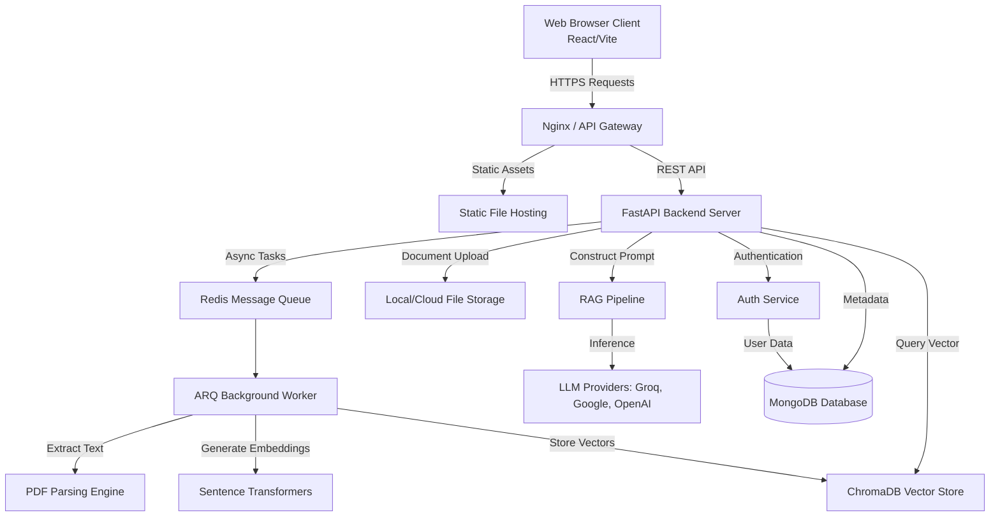
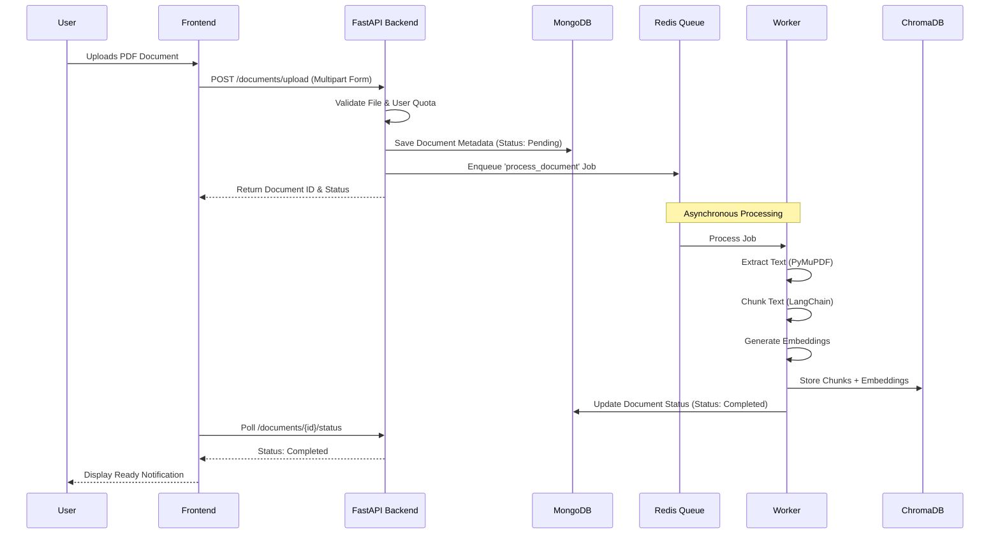
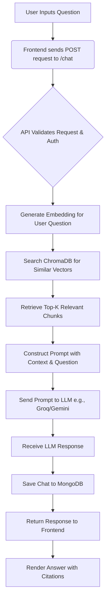

<div align="center">

# 🎓 ScholarAI

```text
  ____       _           _               _    ___ 
 / ___|  ___| |__   ___ | | __ _ _ __   / \  |_ _|
 \___ \ / __| '_ \ / _ \| |/ _` | '__| / _ \  | | 
  ___) | (__| | | | (_) | | (_| | |   / ___ \ | | 
 |____/ \___|_| |_|\___/|_|\__,_|_|  /_/   \_\___|
```

**An Advanced AI-Powered Academic Research Assistant System**

[](https://opensource.org/licenses/MIT)
[](https://fastapi.tiangolo.com)
[](https://reactjs.org/)
[](https://www.typescriptlang.org/)
[](https://www.mongodb.com/)
[](https://tailwindcss.com/)

</div>

---

## 📖 Developer Story

### Why We Built It
The academic landscape is overwhelming. Researchers, students, and educators spend countless hours manually parsing through dense research papers, struggling to find relevant information, summarize findings, and connect concepts across multiple documents. We built ScholarAI to solve this exact problem. Our goal was to create an intelligent system capable of understanding complex academic texts, enabling rapid knowledge retrieval, and ultimately accelerating the research process.

### Who We Are
We are a dedicated team of student developers passionate about leveraging artificial intelligence to solve real-world educational challenges. This project was developed as a comprehensive semester project, demonstrating our ability to architect and deploy complex, full-stack AI applications.

**The Team:**
*   **Godfrey** - Full Stack & AI Integrations
*   **Grish Narayanan S** - Backend Architecture & DevOps
*   **Hariprakash** - Frontend Experience & UI/UX

### Challenges Faced
*   **Handling Complex PDF Structures:** Parsing academic papers with multi-column layouts, tables, and mathematical formulas required extensive tuning of PyMuPDF and PyPDF combinations.
*   **Context Window Limitations:** Designing an effective Retrieval-Augmented Generation (RAG) pipeline to feed relevant context to LLMs without exceeding token limits or losing critical information.
*   **State Management in React:** Ensuring real-time synchronization between the document upload state, processing status, and chat interface using Zustand and React Query.
*   **Performance Optimization:** Vector search over large document collections using ChromaDB needed significant optimization to provide sub-second query responses.

### How We Built It
We adopted a modern, decoupled architecture. The backend is powered by Python and FastAPI, chosen for its asynchronous capabilities and seamless integration with the Python AI ecosystem (LangChain, Groq, Google GenAI). We utilized ChromaDB for local vector storage, allowing us to keep embedding and retrieval fast and private. The frontend is a React 19 application built with Vite, TypeScript, and Tailwind CSS, offering a highly responsive and visually appealing user interface. We utilized Framer Motion to provide smooth transitions and feedback during long-running tasks like document processing.

### Security & UX
*   **Security:** Implemented robust JWT-based authentication stored securely in HttpOnly cookies. Rate limiting and input validation are enforced at the API gateway level to prevent abuse. Role-Based Access Control (RBAC) ensures isolated document access between users.
*   **UX:** Prioritized a clean, distraction-free reading and chatting interface. Uploads are handled via drag-and-drop with real-time progress indicators. The system supports a "dark mode" tailored for long reading sessions, reducing eye strain.

### Key Learnings
*   Deepened our understanding of Vector Databases and semantic search methodologies.
*   Mastered asynchronous programming in Python with FastAPI and ARQ.
*   Learned the intricacies of managing complex React state and optimizing rendering performance in large applications.
*   Gained practical experience with advanced prompt engineering and LLM orchestration.

### Future Roadmap
1.  **Collaborative Workspaces:** Allow multiple researchers to annotate and chat over shared document collections.
2.  **Citation Generation:** Automatic extraction and formatting of citations in various styles (APA, MLA, IEEE).
3.  **Knowledge Graph Integration:** Visualizing relationships between different papers and concepts.
4.  **Cloud Deployment:** Fully containerized Kubernetes deployment for high availability.

### Developer Message
> *"Building ScholarAI has been an incredible journey. We pushed the boundaries of what we thought was possible within a single semester. We hope this system serves as a powerful tool for anyone navigating the complex world of academic research. Dive in, explore the code, and feel free to contribute!"* — The ScholarAI Team

---

## 📑 Table of Contents

1.  [Project Overview](#-project-overview)
2.  [Technology Stack](#-technology-stack)
3.  [System Architecture](#-system-architecture)
4.  [Core Workflows](#-core-workflows)
5.  [Directory Structure](#-directory-structure)
6.  [Installation & Setup](#-installation--setup)
7.  [Configuration](#-configuration)
8.  [API Documentation](#-api-documentation)
9.  [Deployment Guide](#-deployment-guide)
10. [Security & Privacy](#-security--privacy)
11. [Scalability Considerations](#-scalability-considerations)
12. [Testing](#-testing)
13. [Troubleshooting](#-troubleshooting)
14. [Contributing](#-contributing)
15. [License](#-license)
16. [Acknowledgments](#-acknowledgments)
17. [FAQs](#-faqs)

---

## 🌟 Project Overview

**ScholarAI** is a comprehensive Web Application and AI Platform designed specifically for the academic and research community. It acts as an intelligent assistant, enabling users to interact directly with their research documents through advanced natural language processing.

### Industry Domain
EdTech, Academic Research, Artificial Intelligence.

### Target Audience
*   University Students (Undergraduates, Postgraduates, PhD Candidates)
*   Academic Researchers and Professors
*   R&D Professionals in Corporate Sectors
*   Anyone who needs to rapidly digest large volumes of technical or academic literature.

### Primary Purpose
To drastically reduce the time spent reading, summarizing, and extracting key information from academic papers, PDFs, and textbooks by providing a conversational interface powered by state-of-the-art Large Language Models (LLMs) and Retrieval-Augmented Generation (RAG).

---

## 💻 Technology Stack

The project utilizes a modern, robust, and highly scalable technology stack.

### Frontend Technologies
*   **Core:** React 19, TypeScript
*   **Build Tool:** Vite
*   **Styling:** Tailwind CSS 4.x, Framer Motion (Animations)
*   **State Management:** Zustand (Global State), React Query (Server State/Caching)
*   **Routing:** React Router DOM
*   **Forms & Validation:** React Hook Form, Zod
*   **Markdown & Syntax Highlighting:** React Markdown, React Syntax Highlighter

### Backend Technologies
*   **Framework:** FastAPI (Python)
*   **Server:** Uvicorn
*   **Background Jobs:** ARQ (Async Redis Queue)
*   **Data Validation:** Pydantic
*   **Document Processing:** PyPDF, PyMuPDF (Fitz), pdf2image, pytesseract
*   **Web Scraping/Parsing:** BeautifulSoup4, HTTPX

### Database Technologies
*   **Primary Data Store:** MongoDB (Motor Async Driver)
*   **Vector Database:** ChromaDB (Local vector storage)
*   **Caching & Queue Broker:** Redis

### Authentication Technologies
*   **Strategy:** JWT (JSON Web Tokens) via PyJWT
*   **Password Hashing:** bcrypt, passlib
*   **Session Management:** Cookie-based authentication (`connect.sid`)

### AI Services
*   **Orchestration:** LangChain (Text splitters, Prompt management)
*   **LLM Providers:**
    *   Groq (Ultra-fast inference)
    *   Google GenAI (Gemini integration)
    *   OpenAI
    *   Anthropic
*   **Embeddings:** Sentence Transformers, HuggingFace Hub

### Infrastructure Technologies
*   **Proxy/Reverse Proxy:** Nginx (Configuration included)
*   **Environment Management:** python-dotenv

---

## 🏗 System Architecture

ScholarAI follows a modern client-server architecture with specialized micro-services for handling AI inference and document processing.

### High-Level Architecture Diagram



### Component Details

1.  **Presentation Layer (Frontend):** Handles user interactions, document uploads, and displaying chat responses. Communicates with the backend exclusively via RESTful APIs.
2.  **API Layer (Backend):** Built with FastAPI, it routes requests, authenticates users, and orchestrates the flow of data between the database, vector store, and AI models.
3.  **Processing Layer (Workers):** Heavy tasks like parsing 100-page PDFs and generating embeddings are offloaded to background workers using ARQ and Redis. This ensures the main API remains responsive.
4.  **Data Layer:**
    *   **MongoDB:** Stores user profiles, billing plans, document metadata, and chat history.
    *   **ChromaDB:** Stores the mathematical representations (embeddings) of text chunks extracted from documents, enabling semantic similarity search.

---

## 🔄 Core Workflows

### 1. Document Upload and Processing Workflow

This sequence diagram illustrates what happens when a user uploads a new academic paper.



### 2. Retrieval-Augmented Generation (RAG) Query Workflow

When a user asks a question about their uploaded document, the following process occurs:



---

## 📂 Directory Structure

The project is structured as a monorepo containing both the frontend and backend applications.

```text
ScholarAI-AcademicAssistant/
│
├── backend/                  # Python FastAPI Backend
│   ├── app/                  # Application Logic
│   │   ├── api/              # API Route Handlers
│   │   ├── core/             # Configuration, Security, Logging
│   │   ├── models/           # Pydantic & MongoDB Models
│   │   ├── services/         # Business Logic (RAG, Auth, Processing)
│   │   └── main.py           # FastAPI Application Entrypoint
│   ├── chroma_db/            # Local Vector Database Storage (Auto-generated)
│   ├── tests/                # Pytest Test Suites
│   ├── run.py                # Development Server Runner
│   ├── requirements.txt      # Python Dependencies
│   └── pytest.ini            # Pytest Configuration
│
├── frontend/                 # React Frontend
│   ├── src/                  # React Source Code
│   │   ├── components/       # Reusable UI Components
│   │   ├── pages/            # Page/Route Components
│   │   ├── store/            # Zustand State Management
│   │   ├── hooks/            # Custom React Hooks
│   │   ├── lib/              # Utility Functions (Axios instances, helpers)
│   │   └── App.tsx           # Main Application Component
│   ├── public/               # Static Assets (Images, Icons)
│   ├── package.json          # Node Dependencies & Scripts
│   ├── vite.config.ts        # Vite Configuration
│   ├── tsconfig.json         # TypeScript Configuration
│   └── nginx.conf            # Nginx Reverse Proxy Config
│
├── Docs/                     # Additional Documentation
├── start.bat                 # Windows Startup Script
├── start.sh                  # Unix/Linux Startup Script
├── openapi.yaml              # Complete OpenAPI Specification
└── README.md                 # Project Documentation (This File)
```

---

## 🚀 Installation & Setup

Follow these comprehensive steps to set up the ScholarAI development environment on your local machine.

### Prerequisites

Ensure you have the following installed on your system:
*   **Node.js** (v18.0.0 or higher) - Required for the frontend.
*   **Python** (v3.10.0 or higher) - Required for the backend.
*   **MongoDB** - Running locally or accessible via a cloud URI (e.g., MongoDB Atlas).
*   **Redis** - Running locally or accessible via a network URI.
*   **Git** - Version control system.

### Step 1: Clone the Repository

```bash
git clone https://github.com/godfrey/ScholarAI-AcademicAssistant.git
cd ScholarAI-AcademicAssistant
```

### Step 2: Backend Setup

1.  Navigate to the backend directory:
    ```bash
    cd backend
    ```

2.  Create and activate a virtual environment (highly recommended):
    ```bash
    # On Windows
    python -m venv venv
    venv\Scripts\activate

    # On macOS/Linux
    python3 -m venv venv
    source venv/bin/activate
    ```

3.  Install the required Python dependencies:
    ```bash
    pip install -r requirements.txt
    ```

4.  Configure Environment Variables:
    Create a `.env` file in the `backend` directory based on the `.env.test` file or the configuration section below.

5.  Start the backend development server:
    ```bash
    python run.py
    # The API will be available at http://localhost:2022
    ```

### Step 3: Frontend Setup

1.  Open a new terminal window and navigate to the frontend directory:
    ```bash
    cd frontend
    ```

2.  Install the Node dependencies:
    ```bash
    npm install
    # or if using yarn: yarn install
    ```

3.  Start the frontend development server:
    ```bash
    npm run dev
    # The application will be available at http://localhost:5173 (or as configured by Vite)
    ```

### Step 4: Starting the Workers

For background tasks (like PDF processing) to function, you must start the ARQ worker process.
In a new terminal window (with the Python virtual environment activated):

```bash
cd backend
arq app.worker.WorkerSettings
```

---

## ⚙️ Configuration

The system relies heavily on environment variables for configuration. Do not hardcode secrets into the source code.

### Backend `.env` File Example

Create a file named `.env` in the `backend/` directory.

```ini
# Server Configuration
PROJECT_NAME="ScholarAI API"
VERSION="1.0.0"
API_PREFIX="/api"
PORT=2022
DEBUG=True

# Security Configuration
SECRET_KEY="your-super-secret-jwt-key-change-in-production"
ALGORITHM="HS256"
ACCESS_TOKEN_EXPIRE_MINUTES=1440 # 24 hours

# Database Configuration
MONGODB_URL="mongodb://localhost:27017"
MONGODB_DB_NAME="scholarai_db"

# Redis Configuration (For ARQ)
REDIS_URL="redis://localhost:6379/0"

# AI Provider API Keys
GROQ_API_KEY="your-groq-api-key"
GOOGLE_API_KEY="your-gemini-api-key"
OPENAI_API_KEY="your-openai-api-key" # Optional
ANTHROPIC_API_KEY="your-anthropic-api-key" # Optional

# Storage Configuration
UPLOAD_DIRECTORY="./scratch/uploads"
CHROMA_DB_DIRECTORY="./chroma_storage"
```

### Frontend Configuration

The frontend uses Vite's environment variables. Create a `.env` file in the `frontend/` directory.

```ini
# API Endpoint
VITE_API_URL="http://localhost:2022/api"

# Feature Flags
VITE_ENABLE_ANALYTICS=false
```

---

## 📚 API Documentation

ScholarAI provides a comprehensive RESTful API. Below is a subset of the critical endpoints. The full interactive Swagger documentation is automatically generated by FastAPI and can be accessed at `http://localhost:2022/docs` when the backend is running.

You can also view the complete specification in the `openapi.yaml` file located in the project root.

### Authentication Endpoints

#### `POST /api/auth/register`
Creates a new user account.

**Request Body:**
```json
{
  "email": "user@university.edu",
  "password": "SecurePassword123!",
  "name": "Jane Doe"
}
```
**Response (201 Created):** User registered successfully.

#### `POST /api/auth/login`
Authenticates a user and sets an HttpOnly cookie containing the JWT session token.

**Request Body:**
```json
{
  "email": "user@university.edu",
  "password": "SecurePassword123!"
}
```
**Response (200 OK):**
```json
{
  "user": {
    "_id": "60d5ecb54b3... ",
    "email": "user@university.edu",
    "name": "Jane Doe",
    "role": "user",
    "planTier": "FREE"
  }
}
```

### Document Endpoints

#### `GET /api/documents`
Retrieves a list of all documents uploaded by the authenticated user. Requires valid session cookie.

**Response (200 OK):**
```json
[
  {
    "id": "doc_123",
    "filename": "quantum_computing_review.pdf",
    "uploadDate": "2023-10-27T10:00:00Z",
    "status": "COMPLETED",
    "sizeBytes": 2048576
  }
]
```

#### `POST /api/documents/upload`
Uploads a new document for processing. Requires valid session cookie. Payload is `multipart/form-data`.

### Chat/RAG Endpoints

#### `POST /api/chat/query`
Sends a question related to a specific document.

**Request Body:**
```json
{
  "documentId": "doc_123",
  "query": "What are the main limitations of the Qubit decoherence mentioned in the paper?"
}
```
**Response (200 OK):**
```json
{
  "answer": "Based on the provided text, the main limitations are... [Detailed Response]",
  "sources": [
    {
      "pageNumber": 12,
      "textSnippet": "...decoherence times remain a significant hurdle..."
    }
  ]
}
```

---

## 🚢 Deployment Guide

This section outlines how to deploy ScholarAI to a production environment.

### Dockerized Deployment (Recommended)

To deploy using Docker, you would typically use Docker Compose to orchestrate the Frontend, Backend, MongoDB, and Redis containers.

*Note: Dockerfiles are not explicitly provided in the base repository yet, but this is the standard approach.*

**Sample `docker-compose.yml` structure:**

```yaml
version: '3.8'

services:
  frontend:
    build: ./frontend
    ports:
      - "80:80"
    depends_on:
      - backend

  backend:
    build: ./backend
    ports:
      - "2022:2022"
    environment:
      - MONGODB_URL=mongodb://mongo:27017
      - REDIS_URL=redis://redis:6379/0
      # ... other environment variables
    depends_on:
      - mongo
      - redis

  worker:
    build: ./backend
    command: arq app.worker.WorkerSettings
    environment:
      - MONGODB_URL=mongodb://mongo:27017
      - REDIS_URL=redis://redis:6379/0
      # ... other environment variables
    depends_on:
      - mongo
      - redis

  mongo:
    image: mongo:latest
    ports:
      - "27017:27017"
    volumes:
      - mongo_data:/data/db

  redis:
    image: redis:alpine
    ports:
      - "6379:6379"

volumes:
  mongo_data:
```

### Traditional Server Deployment (Ubuntu/Linux)

1.  **Server Setup:** Provision a Virtual Private Server (VPS) from AWS (EC2), DigitalOcean, or Linode.
2.  **Dependencies:** Install Nginx, Python 3.10+, Node.js, Redis, and MongoDB on the server.
3.  **Backend Setup:**
    *   Clone the repository.
    *   Set up a virtual environment and install dependencies.
    *   Configure systemd services to run the FastAPI application via Gunicorn with Uvicorn workers.
    *   Configure a systemd service for the ARQ worker.
4.  **Frontend Setup:**
    *   Navigate to the frontend directory.
    *   Run `npm install` and `npm run build`.
    *   The compiled assets will be in the `dist` folder.
5.  **Nginx Configuration:**
    *   Use the provided `frontend/nginx.conf` as a template.
    *   Configure Nginx to serve the static frontend files from the `dist` directory.
    *   Set up a reverse proxy in Nginx to forward API requests (e.g., `/api/*`) to the Gunicorn server running on port 2022.
6.  **SSL/TLS:** Use Certbot (Let's Encrypt) to secure your domain with HTTPS.

---

## 🔒 Security & Privacy

Security is paramount, especially when handling potentially sensitive academic research and user data.

*   **Authentication:** We use industry-standard JSON Web Tokens (JWT) for authentication. Tokens are stored in HttpOnly, Secure cookies to prevent Cross-Site Scripting (XSS) attacks.
*   **Password Hashing:** Passwords are never stored in plaintext. They are hashed using `bcrypt` with a strong work factor before being stored in the database.
*   **Data Isolation:** The system employs Role-Based Access Control (RBAC) and strict ownership checks. A user can only query and access documents they have explicitly uploaded.
*   **Vector Database Security:** ChromaDB runs locally within the backend network context. It is not exposed to the public internet.
*   **Input Validation:** All API inputs are strictly validated using Pydantic schemas, preventing SQL injection (though MongoDB is used) and NoSQL injection attacks.
*   **API Rate Limiting:** Prevent abuse and DDoS attacks by limiting the number of requests per IP address.

---

## 📈 Scalability Considerations

As user adoption grows, the system is designed to scale horizontally.

1.  **Stateless API:** The FastAPI backend is completely stateless (session state is in JWT/MongoDB), allowing you to spin up multiple instances behind a load balancer (like Nginx or AWS ALB).
2.  **Asynchronous Workers:** Document processing is CPU-intensive. By decoupling this via Redis and ARQ, you can scale the number of worker instances independently from the web API instances to handle spikes in document uploads.
3.  **Database Scaling:**
    *   **MongoDB:** Can be scaled horizontally using Sharding if the user/metadata volume becomes massive.
    *   **ChromaDB:** For enterprise scale, the local ChromaDB instance should be migrated to a distributed vector database solution like Milvus, Pinecone, or a managed Chroma cloud instance.
4.  **Caching:** Implement aggressive caching strategies using Redis for frequently accessed metadata or popular queries to reduce LLM API calls and database load.

---

## 🧪 Testing

Ensuring code quality and reliability is a core part of the development process.

### Backend Testing

The backend uses `pytest` for unit and integration testing.

```bash
cd backend
# Run all tests
pytest

# Run tests with coverage report
pytest --cov=app tests/
```

*Note: Ensure you have set up a separate test database (configured via `.env.test`) to avoid modifying your development data.*

### Frontend Testing

*(Add frontend testing commands here if implemented, e.g., using Vitest or Jest)*
Currently, the focus is on manual QA and static analysis via TypeScript.

```bash
cd frontend
# Run TypeScript compiler checks
npm run lint
```

---

## 🛠 Troubleshooting

**Issue:** Backend server fails to start.
*   **Solution:** Ensure MongoDB and Redis are running and accessible at the URLs specified in your `.env` file. Check that all required Python dependencies are installed in your activated virtual environment.

**Issue:** Document processing is stuck in 'Pending' state.
*   **Solution:** Ensure the ARQ background worker is running (`arq app.worker.WorkerSettings` in the backend directory). Check the worker logs for any errors related to PDF parsing or API limits with the LLM providers.

**Issue:** Frontend shows 'Network Error' when attempting to login or upload.
*   **Solution:** Verify that the `VITE_API_URL` in the frontend `.env` is pointing to the correct backend address (usually `http://localhost:2022/api`). Ensure the backend is actually running. Check CORS configurations in FastAPI if accessing from a different domain.

**Issue:** High memory usage by ChromaDB.
*   **Solution:** Local ChromaDB keeps a lot of data in memory. If processing massive documents, you may need to increase your system's RAM or migrate to a client/server vector database model.

---

## 🤝 Contributing

We welcome contributions to ScholarAI!

1.  Fork the repository.
2.  Create a feature branch: `git checkout -b feature/amazing-feature`.
3.  Commit your changes: `git commit -m 'Add amazing feature'`.
4.  Push to the branch: `git push origin feature/amazing-feature`.
5.  Open a Pull Request.

Please ensure your code follows the existing style guidelines and passes all tests.

---

## 📄 License

This project is licensed under the MIT License - see the [LICENSE](LICENSE) file for details.

---

## 🙏 Acknowledgments

*   The creators and maintainers of **FastAPI**, **React**, and **Tailwind CSS**.
*   **LangChain** for simplifying LLM orchestration.
*   **HuggingFace** for providing accessible open-source embedding models.
*   Our university professors and peers for their invaluable feedback during the development process.

---

## ❓ FAQs

**Q: Do I need an OpenAI API key to use this?**
A: Not necessarily. The system is configured to support multiple providers including Groq and Google GenAI. You only need API keys for the services you intend to use. Groq provides a very generous free tier which is excellent for development.

**Q: How is data stored?**
A: User data and document metadata are stored in MongoDB. The actual text content is extracted, converted into vector embeddings, and stored locally in ChromaDB. Original PDF files are stored in the local file system (or configurable cloud storage).

**Q: Can I use this for commercial purposes?**
A: Yes, the project is released under the MIT License, which permits commercial use. However, you must comply with the terms of service of the third-party APIs (LLMs, etc.) you connect to the system.

**Q: Is the system capable of handling images within PDFs?**
A: The system utilizes `PyMuPDF` and `pytesseract` to attempt text extraction, but complex diagrams and non-textual image analysis are currently outside the primary scope of the RAG pipeline. The focus is on textual academic content.

---

<div align="center">
  <i>ScholarAI Team. Innovate Build Impact!</i>
</div>
