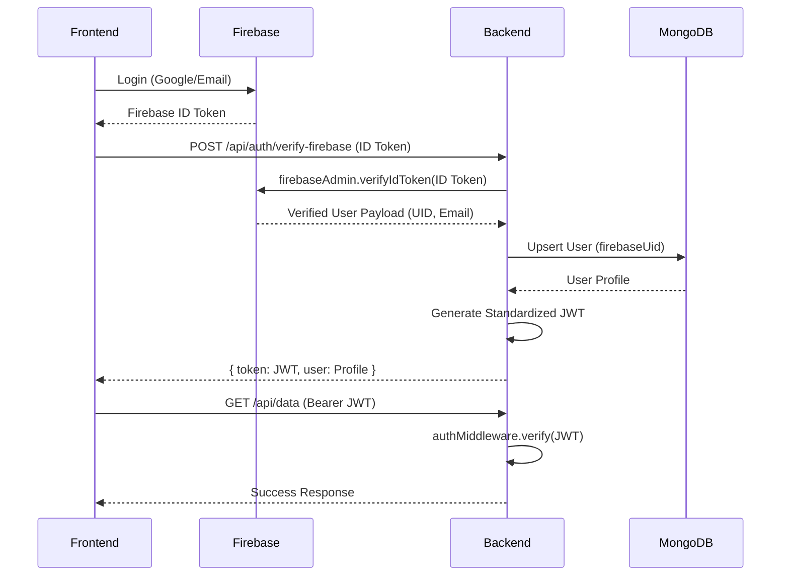

# Authentication and Identity System Redesign Plan

This plan outlines the steps to fix the broken authentication system by implementing a hybrid enterprise identity flow.

## User Review Required

> [!IMPORTANT]
> - **Deprecation of Local Passwords**: All local password storage and verification logic will be removed in favor of Firebase Authentication.
> - **Standardized JWT**: The backend will issue its own JWT after verifying the Firebase ID Token. This JWT will be the **only** token used for subsequent API requests.
> - **Service Account**: Ensure `serviceAccountKey.json` is correctly placed in the `backend/` directory or the corresponding environment variables are set.

## Proposed Changes

### 1. MongoDB Schema Redesign
Update the User model to serve as the single source of truth.

#### [MODIFY] [User.ts](file:///e:/PROJECTS/ARAS/backend/src/models/User.ts)
- Add `firebaseUid: { type: String, unique: true, required: true }`.
- Add `authProviders: [String]`.
- Remove `password` field.
- Ensure `role`, `planTier`, `subscriptionStatus`, `name`, and `email` are managed correctly.
- Add indexes for `firebaseUid` and `email`.

### 2. Firebase & Auth Services
Implement the core logic for Firebase verification and user synchronization.

#### [NEW] [firebaseAdmin.ts](file:///e:/PROJECTS/ARAS/backend/src/config/firebaseAdmin.ts)
- Initialize Firebase Admin SDK using environment variables (`FIREBASE_PROJECT_ID`, `FIREBASE_CLIENT_EMAIL`, `FIREBASE_PRIVATE_KEY`).

#### [NEW] [authService.ts](file:///e:/PROJECTS/ARAS/backend/src/services/authService.ts)
- `verifyFirebaseToken(idToken: string)`: Use Admin SDK to verify the token and return user details.
- `syncUser(firebaseUser: any)`: Perform an idempotent UPSERT in MongoDB.
- `generateToken(user: IUser)`: Issue a standardized backend JWT.

### 3. Middleware & Controller Updates
Standardize API access and handle the login flow.

#### [MODIFY] [authMiddleware.ts](file:///e:/PROJECTS/ARAS/backend/src/middleware/authMiddleware.ts)
- Strictly validate `Authorization: Bearer <JWT>`.
- Verify the backend JWT signature using `JWT_SECRET`.
- Attach verified user context to `req.user`.
- Fail safely with structured errors (401/403).

#### [MODIFY] [authController.ts](file:///e:/PROJECTS/ARAS/backend/src/controllers/authController.ts)
- Add `verifyFirebaseToken` endpoint to handle the frontend login flow.
- Remove old `login`, `register`, and `changePassword` (managed by Firebase).

#### [MODIFY] [authRoutes.ts](file:///e:/PROJECTS/ARAS/backend/src/routes/authRoutes.ts)
- Replace old routes with the new verification endpoint.

### 4. Rate Limiting
Implement layered rate limiting strategy.

#### [MODIFY] [rateLimiter.ts](file:///e:/PROJECTS/ARAS/backend/src/middleware/rateLimiter.ts)
- Update `authLimiter` for the new auth endpoint.
- Ensure public and protected APIs have distinct, enterprise-safe limits.

## Sequence Diagram

## Open Questions

- Should we migrate existing MongoDB users to Firebase if they don't have a `firebaseUid`?
- Are there any specific claims or metadata from Firebase that should be stored in MongoDB (e.g., photoURL)?

## Verification Plan

### Automated Tests
- `npm run test` (if available) or manual endpoint testing via Postman/Curl.
- Verify that sending an expired Firebase token returns 401.
- Verify that sending a valid Firebase token creates/updates the MongoDB user and returns a valid backend JWT.
- Verify that subsequent requests with the backend JWT work correctly.

### Manual Verification
1. Log in via Frontend (using Google).
2. Check backend logs for Firebase verification and MongoDB sync.
3. Verify JWT is received and used for `/api/auth/profile`.
4. Test rate limiting by hammering the auth endpoint.
