# ARAS — System Architecture

> **Academic Research Assistant System** · v2.1.x · Generated 2026-04-15
odule	Port
Gateway	80
Frontend (Vite)	5173
Auth Service	5001
Backend (Express)	5000
Chat Service	5002
Payment Service	5003
ML Service	8000
Redis	6379
SMTP (Mailtrap)	2525
MongoDB	Atlas Cloud (SRV)

```mermaid
graph TD

  %% ─── CLIENT ──────────────────────────────────────────────────────────────
  subgraph CLIENT["🌐  Client — Browser"]
    direction TB
    SPA["React 19 SPA<br/><i>Vite · TypeScript · Tailwind v4</i>"]
    PAGES["Pages<br/>Landing · Login · Dashboard · Upload<br/>Library · Insights · Search · Chat<br/>Comparison · Settings · Admin · Docs"]
    ROUTER["React Router v7<br/><i>Declarative Mode</i>"]
    STATE["State Layer<br/><i>Zustand · TanStack Query</i>"]
    FB_SDK["Firebase Auth SDK<br/><i>Google / Email Sign-In</i>"]
    AXCLIENT["Axios HTTP Client<br/><i>JWT Bearer Token</i>"]

    SPA --> PAGES
    SPA --> ROUTER
    SPA --> STATE
    SPA --> FB_SDK
    STATE --> AXCLIENT
  end

  %% ─── FRONTEND CONTAINER ──────────────────────────────────────────────────
  subgraph FE_CONTAINER["🐳  Frontend Container  (port 5173 → 80)"]
    NGINX["Nginx<br/><i>Static Asset Server · SPA fallback</i>"]
  end

  AXCLIENT -->|"HTTPS REST"| API_GW

  %% ─── BACKEND API ─────────────────────────────────────────────────────────
  subgraph BACKEND["🐳  Backend — Express API  (port 5000)"]
    direction TB

    subgraph MW["Middleware Chain"]
      HELMET["Helmet<br/><i>Security Headers</i>"]
      CORS_MW["CORS"]
      RATE["Rate Limiter<br/><i>express-rate-limit</i>"]
      AUTH_MW["Auth Middleware<br/><i>Firebase ID-Token verify</i>"]
      ADMIN_MW["Admin Middleware<br/><i>role === admin</i>"]
      ERR_MW["Error Handler"]
    end

    API_GW["Express Router<br/>/api/*"]

    subgraph ROUTES["API Routes"]
      R_AUTH["/api/auth"]
      R_DOC["/api/documents"]
      R_SEARCH["/api/search"]
      R_ANALYSIS["/api/analysis"]
      R_CHAT["/api/chat"]
      R_ADMIN["/api/admin"]
      R_HEALTH["/api/health · /health · /metrics"]
    end

    subgraph CTRL["Controllers"]
      C_DOC["documentController"]
      C_SEARCH["searchController"]
      C_ANALYSIS["analysisController"]
      C_CHAT["chatController"]
      C_ADMIN["adminController"]
    end

    subgraph SVC["Services"]
      S_STORE["storageService<br/><i>GCS / Local FS</i>"]
      S_PDF["pdfExtractor"]
      S_CHUNK["textChunker"]
      S_GEMINI["geminiService<br/><i>Gemini API</i>"]
      S_EMBED["embeddingService"]
      S_VEC["vectorSearchService"]
      S_ANALYSIS["analysisService"]
      S_COMPARE["comparisonService"]
      S_HEALTH["healthService"]
    end

    HELMET --> CORS_MW --> RATE --> AUTH_MW --> API_GW
    API_GW --> R_AUTH & R_DOC & R_SEARCH & R_ANALYSIS & R_CHAT & R_HEALTH
    API_GW --> ADMIN_MW --> R_ADMIN
    R_DOC --> C_DOC
    R_SEARCH --> C_SEARCH
    R_ANALYSIS --> C_ANALYSIS
    R_CHAT --> C_CHAT
    R_ADMIN --> C_ADMIN
    C_DOC --> S_STORE & S_PDF
    C_ANALYSIS --> S_ANALYSIS & S_GEMINI
    C_CHAT --> S_VEC & S_GEMINI
    C_SEARCH --> S_VEC
    S_ANALYSIS --> S_GEMINI
    S_COMPARE --> S_GEMINI
    S_VEC --> S_EMBED
    S_EMBED --> S_GEMINI
    C_HEALTH --> S_HEALTH
    R_HEALTH --> C_HEALTH["healthController"]
  end

  %% ─── BULLMQ QUEUES ───────────────────────────────────────────────────────
  subgraph QUEUES["📨  BullMQ Queues  (via Redis)"]
    Q1["document-processing"]
    Q2["document-analysis"]
    Q3["vector-indexer"]
    Q4["metrics-collector"]
  end

  %% ─── WORKERS ─────────────────────────────────────────────────────────────
  subgraph WORKERS["🐳  Backend Workers Container"]
    direction TB
    W_DOC["documentProcessor.worker<br/><i>concurrency: 2</i>"]
    W_ANALYSIS["analysis.worker<br/><i>concurrency: 3</i>"]
    W_VEC["vectorIndexer.worker<br/><i>concurrency: 5</i>"]
    W_METRICS["metricsCollector.worker<br/><i>concurrency: 1</i>"]
  end

  C_DOC -->|"enqueue job"| Q1
  C_ANALYSIS -->|"enqueue job"| Q2
  Q1 --> W_DOC
  Q2 --> W_ANALYSIS
  Q3 --> W_VEC
  Q4 --> W_METRICS

  %% ─── ML SERVICE ──────────────────────────────────────────────────────────
  subgraph ML["🐳  ML Service — FastAPI/Python  (port 8000)"]
    direction TB

    subgraph ML_ROUTES["Routes  (X-API-Key protected)"]
      ML_PROC["POST /process-document"]
      ML_SEARCH["POST /search"]
      ML_CHAT["POST /chat"]
      ML_STREAM["POST /chat/stream  (SSE)"]
      ML_ANALYZE["POST /analyze-document"]
    end

    subgraph ML_PIPE["Pipelines"]
      P_PROC["process pipeline<br/><i>PyMuPDF → chunk → embed → store</i>"]
      P_SEARCH["search pipeline<br/><i>Hybrid: Vector + BM25</i>"]
      P_CHAT["chat pipeline<br/><i>RAG · Gemini</i>"]
      P_ANALYZE["analyze pipeline<br/><i>Gemini structured output</i>"]
    end

    ML_SVC_EMBED["embedding_service<br/><i>Gemini text-embedding-004 (768-dim)</i>"]
    ML_DB["db service<br/><i>Motor async MongoDB driver</i>"]

    ML_PROC --> P_PROC
    ML_SEARCH --> P_SEARCH
    ML_CHAT --> P_CHAT & P_CHAT
    ML_STREAM --> P_CHAT
    ML_ANALYZE --> P_ANALYZE
    P_PROC --> ML_SVC_EMBED & ML_DB
    P_SEARCH --> ML_SVC_EMBED & ML_DB
    P_CHAT --> ML_SVC_EMBED & ML_DB
    P_ANALYZE --> ML_SVC_EMBED
    ML_SVC_EMBED --> GEMINI_EXT
  end

  W_DOC -->|"POST /process-document"| ML_PROC
  W_ANALYSIS -->|"POST /analyze-document"| ML_ANALYZE
  C_SEARCH -->|"POST /search"| ML_SEARCH
  C_CHAT -->|"POST /chat[/stream]"| ML_CHAT
  W_VEC -->|"POST /process-document"| ML_PROC

  %% ─── DATA LAYER ──────────────────────────────────────────────────────────
  subgraph DATA["🗄️  Data Layer"]
    MONGO[("MongoDB Atlas<br/><i>Users · Documents · DocumentChunks<br/>AnalysisResults · ChatMessages · Metrics</i>")]
    REDIS[("Redis 7<br/><i>BullMQ Job Store · Rate-limit cache</i>")]
  end

  BACKEND -->|"Mongoose ODM"| MONGO
  WORKERS -->|"Mongoose ODM"| MONGO
  ML_DB -->|"Motor async"| MONGO
  BACKEND -->|"ioredis"| REDIS
  WORKERS -->|"ioredis"| REDIS

  %% ─── EXTERNAL SERVICES ───────────────────────────────────────────────────
  subgraph EXT["☁️  External Services"]
    FB_AUTH[("Firebase Auth<br/><i>Google Cloud IAM</i>")]
    GEMINI_EXT[("Google Gemini API<br/><i>gemini-2.0-flash · text-embedding-004</i>")]
    GCS[("Google Cloud Storage<br/><i>PDF file store</i>")]
  end

  FB_SDK -->|"getIdToken()"| FB_AUTH
  AUTH_MW -->|"verifyIdToken()"| FB_AUTH
  S_GEMINI -->|"generateContent()"| GEMINI_EXT
  S_STORE -->|"upload / download"| GCS
  W_DOC -->|"download PDF"| GCS

  %% ─── OBSERVABILITY ───────────────────────────────────────────────────────
  subgraph OBS["📊  Observability"]
    PROM["Prometheus<br/><i>port 9090 · scrape: 15 s</i>"]
  end

  PROM -->|"GET /metrics"| BACKEND

  %% ─── DOCKER NETWORK LINKS ────────────────────────────────────────────────
  NGINX -.->|"serves bundle"| SPA
  CLIENT -.->|"served by"| FE_CONTAINER

  %% ─── STYLES ──────────────────────────────────────────────────────────────
  classDef container fill:#1e293b,stroke:#334155,color:#f1f5f9
  classDef ext fill:#0f4c8a,stroke:#1d6fb8,color:#e0f2fe
  classDef data fill:#14532d,stroke:#15803d,color:#dcfce7
  classDef obs fill:#581c87,stroke:#7c3aed,color:#ede9fe
  classDef worker fill:#7c2d12,stroke:#b45309,color:#fef3c7
  classDef ml fill:#134e4a,stroke:#0d9488,color:#ccfbf1

  class BACKEND container
  class FE_CONTAINER container
  class EXT ext
  class FB_AUTH,GEMINI_EXT,GCS ext
  class DATA data
  class MONGO,REDIS data
  class OBS,PROM obs
  class WORKERS,W_DOC,W_ANALYSIS,W_VEC,W_METRICS worker
  class ML,ML_ROUTES,ML_PIPE ml
```




---

## Service Inventory

| Container | Image / Runtime | Port | Key Dependencies |
|---|---|---|---|
| `aras-frontend` | Nginx + React/Vite bundle | 5173 → 80 | Firebase SDK, Axios, Zustand, TanStack Query |
| `aras-backend` | Node.js 20 / Express | 5000 | Firebase Admin, Mongoose, ioredis, BullMQ, Gemini |
| `aras-workers` | Node.js 20 / BullMQ | — | Mongoose, ioredis, Gemini, GCS |
| `aras-ml-service` | Python 3.x / FastAPI + Uvicorn | 8000 | Motor, Gemini API, PyMuPDF, rank-bm25 |
| `aras-redis` | Redis 7 Alpine | 6379 | — |
| `aras-prometheus` | prom/prometheus | 9090 | — |

## Data Models (MongoDB)

| Collection | Purpose |
|---|---|
| `users` | Firebase UID, email, role, stats |
| `documents` | PDF metadata, storage URL, status |
| `documentchunks` | Text chunks + 768-dim vector embeddings |
| `analysisresults` | Gemini structured analysis per document |
| `chatmessages` | RAG conversation history |
| `systemmetrics` | Periodic health/usage snapshots |

## Async Job Flow (Document Upload)

```
Browser → POST /api/documents (multipart PDF)
  → storageService uploads PDF to GCS/LocalFS
  → DocumentModel saved (status: processing)
  → Job enqueued → document-processing queue (Redis/BullMQ)
     → documentProcessor.worker picks up job
        → downloads PDF from GCS
        → ML Service POST /process-document
           → PyMuPDF extraction → LangChain chunking
           → Gemini text-embedding-004 (768-dim per chunk)
           → DocumentChunks stored in MongoDB (with vector index)
        → status updated → completed
     → analysisWorker picks up analysis job
        → ML Service POST /analyze-document (Gemini)
        → AnalysisResult stored in MongoDB
```
