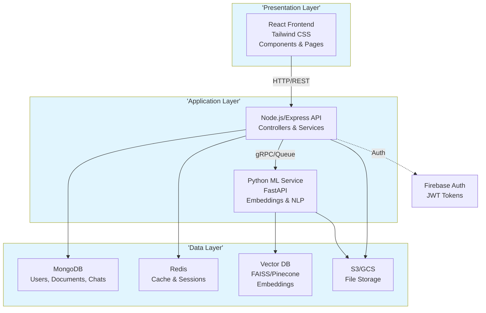
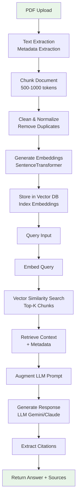
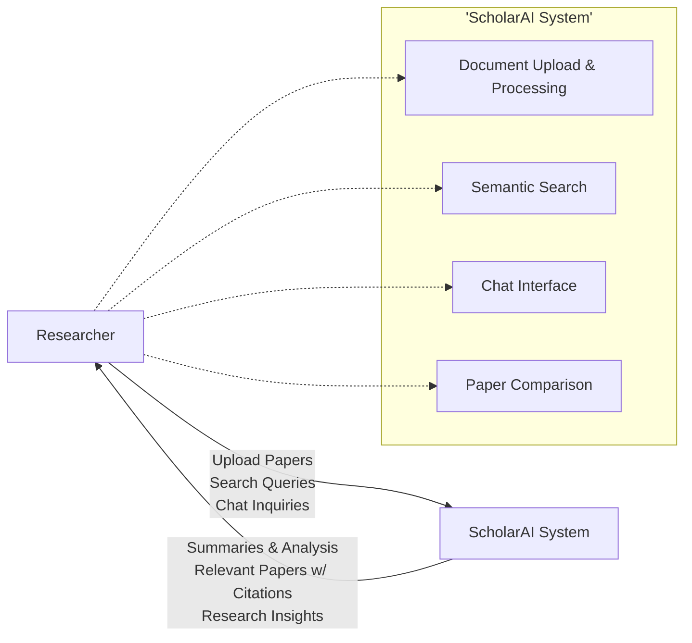
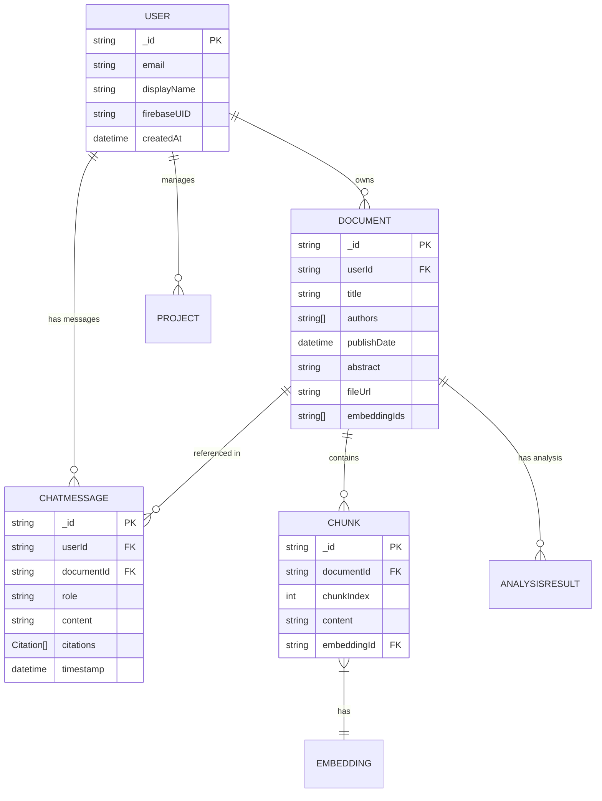
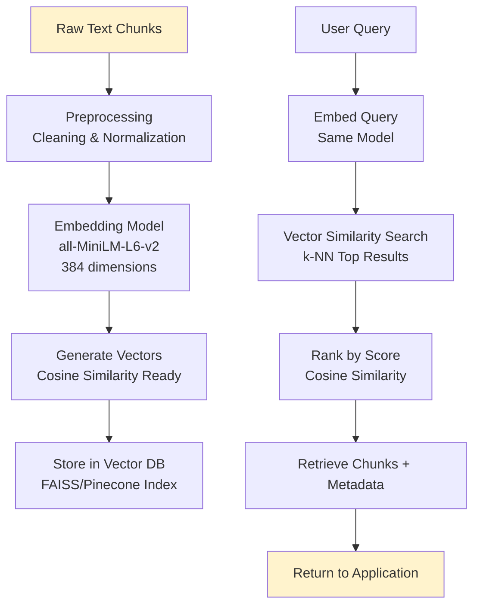
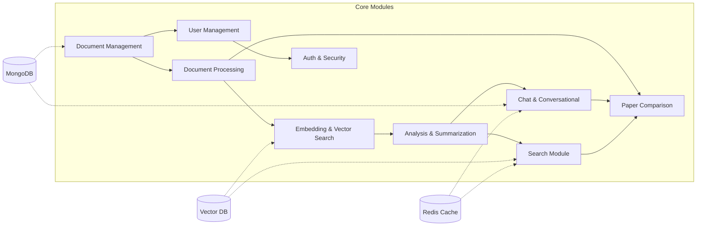

Created comprehensive mermaid-diagrams.md file containing Mermaid code for all key diagrams referenced in PROJECT_DOCUMENTATION.md:

Chapter 1 - Introduction:

Figure 1.1 – ScholarAI System Architecture Overview (graph TB)
Figure 1.2 – RAG Pipeline Workflow (flowchart TD)
Chapter 4 - Proposed System (Section 4.2):

Figure 4.2 – Data Flow Diagram (DFD) - Level 0 (flowchart LR)
Figure 4.4 – Database Schema: User, Document, and ChatMessage Relationships (erDiagram)
Figure 4.5 – Authentication Flow with JWT (flowchart TD - added based on updates)
Figure 4.7 – Vector Embedding and Semantic Search Process (flowchart TD)
Chapter 6 - System Implementations:

Figure 6.1 – Module Interaction Diagram (graph LR)
Chapter 7 - System Testing:

Figure 7.2 – System Performance Metrics Dashboard (graph TD)
Usage: Copy individual Mermaid blocks to Mermaid Live Editor, VS Code Mermaid Preview, or GitHub for rendering/export as SVG/PNG.

All diagrams match the exact descriptions/specifications from PROJECT_DOCUMENTATION.md and are ready for visual presentation without editing the main report.


## Figure 1.1 – ScholarAI System Architecture Overview



## Figure 1.2 – RAG Pipeline Workflow



## Figure 4.2 – Data Flow Diagram (DFD) - Level 0



## Figure 4.4 – Database Schema: User, Document, and ChatMessage Relationships



## Figure 4.7 – Vector Embedding and Semantic Search Process



## Figure 6.1 – Module Interaction Diagram



## Figure 7.2 – System Performance Metrics Dashboard

```mermaid
graph TD
    subgraph Metrics['Performance Metrics Collection']
        A[API Response Time<br/>P95: 450ms]
        B[Document Processing<br/>Avg: 15s]
        C[Search Latency<br/>Avg: 180ms]
        D[System Uptime<br/>99.7%]
        E[Concurrent Users<br/>2,500 req/s]
        F[Error Rate<br/><1%]
    end
    
    G[Prometheus<br/>Scraping] --> A
    G --> B
    G --> C
    G --> D
    G --> E
    G --> F
    
    G --> H[Grafana<br/>Dashboard]
    H --> I[Real-time Alerts]
    
    J[Backend Services] --> G
    K[ML Service] --> G
    L[Databases] --> G
    
    style H fill:#d4edda

## Figure 7.3 – CI Pipeline Workflow

```mermaid
flowchart TD
    subgraph GitHub['GitHub Repository']
        A[Push / Pull Request]
    end
    
    subgraph Actions['GitHub Actions Runner']
        B[Checkout Code] --> C[Setup Python 3.11]
        C --> D[Install Dependencies]
        D --> E[Run Ruff Lint]
        E --> F[Run ML Unit Tests]
        
        subgraph Verification['Verification']
            F --> G{Passed?}
        end
    end
    
    G -- Yes --> H[Merge Approved]
    G -- No --> I[Block Merge / Alert]
    
    style GitHub fill:#f5f5f5
    style Actions fill:#fff3cd
    style Verification fill:#d1e7dd
```
```

## Usage Instructions

1. Copy individual Mermaid code blocks to [Mermaid Live Editor](https://mermaid.live/)
2. Or use VS Code Mermaid Preview extension
3. GitHub Markdown rendering supports Mermaid natively
4. Export as SVG/PNG for documents

These diagrams are derived directly from the ScholarAI system architecture described in `PROJECT_DOCUMENTATION.md`.
