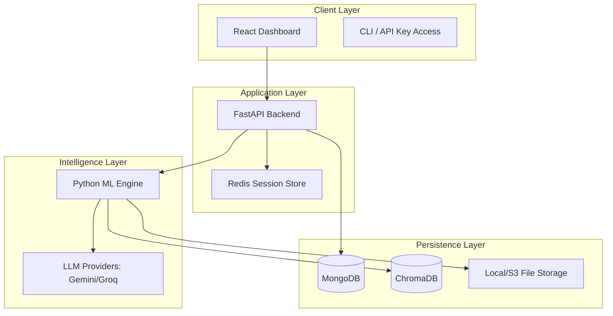
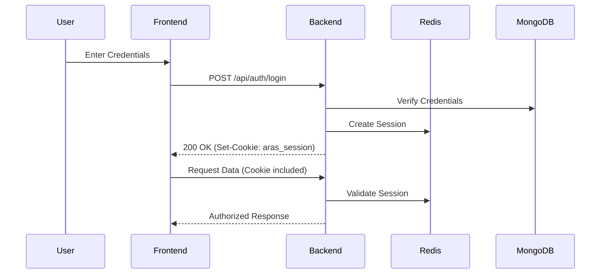

# ScholarAI — Advanced Research Assistant System

[](https://github.com/OrionGD/ARAS/actions/workflows/ml-ci.yml)
[](https://github.com/OrionGD/ARAS)
[](LICENSE)
[](https://github.com/OrionGD/ARAS)
[](https://github.com/OrionGD/ARAS)

> **The Intelligent Retrieval-Augmented Generation (RAG) platform for modern researchers.**

ScholarAI (Advanced Research Assistant System) is a production-grade academic research platform designed to transform how scholars process, analyze, and synthesize academic literature. By combining state-of-the-art Large Language Models (LLMs) with high-performance vector search, ScholarAI converts static PDF libraries into dynamic, queryable knowledge ecosystems.

---

## 🎥 Product Demo

Experience ScholarAI in action. Watch how we transform a raw PDF into a structured knowledge base in seconds.

<div align="center">
  <iframe width="100%" height="450" src="https://drive.google.com/file/d/1X_dii7xIoHoU8KONFGrmpKPKAnS30bSL/preview" frameborder="0" allow="autoplay; encrypted-media" allowfullscreen></iframe>
</div>

---

## 📑 Table of Contents

1. [Executive Summary](#-executive-summary)
2. [Problem Statement](#-problem-statement)
3. [The ScholarAI Solution](#-the-scholarai-solution)
4. [Core Features](#-core-features)
    - [Intelligent Ingestion](#intelligent-ingestion)
    - [Semantic Search](#semantic-search)
    - [RAG Chat Interface](#rag-chat-interface)
    - [Comparative Analysis](#comparative-analysis)
5. [Technology Stack Deep Dive](#-technology-stack-deep-dive)
6. [System Architecture & Design](#-system-architecture--design)
7. [Detailed API Documentation](#-detailed-api-documentation)
    - [Authentication API](#authentication-api)
    - [Document Management API](#document-management-api)
    - [Search & Intelligence API](#search--intelligence-api)
    - [Chat & Context API](#chat--context-api)
8. [Setup & Installation Guide](#-setup--installation-guide)
    - [Windows Installation](#windows-installation)
    - [Linux/macOS Installation](#linuxmacos-installation)
    - [Docker & Containerization](#docker--containerization)
9. [Configuration & Environment Management](#-configuration--environment-management)
10. [ML Pipeline & Algorithms](#-ml-pipeline--algorithms)
    - [Text Extraction Methodology](#text-extraction-methodology)
    - [Embedding Strategy](#embedding-strategy)
    - [Retrieval Optimization](#retrieval-optimization)
11. [Testing & Quality Assurance Framework](#-testing--quality-assurance-framework)
12. [CI/CD Infrastructure](#-cicd-infrastructure)
13. [Security, Privacy & Ethics](#-security-privacy--ethics)
14. [Performance Benchmarks](#-performance-benchmarks)
15. [Troubleshooting & Comprehensive FAQ](#-troubleshooting--comprehensive-faq)
16. [Project Roadmap](#-project-roadmap)
17. [Contribution Guidelines](#-contribution-guidelines)
18. [Project File Structure](#-project-file-structure)
19. [Glossary of Terms](#-glossary-of-terms)
20. [References & Citations](#-references--citations)
21. [License & Acknowledgments](#-license--acknowledgments)

---

## 📖 Executive Summary

ScholarAI is an advanced AI-driven research assistant designed to meet the rigorous demands of modern academia. In an era where information grows at an exponential rate, researchers often struggle to keep pace with the sheer volume of new publications in their fields. ScholarAI provides a comprehensive, centralized platform that leverages the latest advancements in Artificial Intelligence to automate the most time-consuming aspects of the research workflow.

The system is built on a microservices architecture, ensuring that each component—from the high-performance Python ML engine to the responsive React frontend—can scale independently. At its core, ScholarAI implements a state-of-the-art RAG (Retrieval-Augmented Generation) pipeline, which ensures that all AI-generated insights are grounded in the user's specific document library, drastically reducing the risk of hallucinations and providing verifiable citations for every claim.

---

## ⚠️ Problem Statement

### The Information Overload Crisis
The volume of academic literature is doubling every few years in many scientific disciplines. For an individual researcher, staying current is no longer just difficult; it is mathematically impossible using traditional methods.

### Current Workflow Inefficiencies:
1.  **Semantic Gap**: Keyword search (e.g., Google Scholar) often misses semantically identical but terminologically different research (e.g., "Deep Learning" vs. "Neural Networks").
2.  **Cognitive Load**: Reading a 30-page paper to extract just the methodology and key findings takes significant mental energy and hours of time.
3.  **Fragmented Knowledge**: Insights from different papers are often trapped in separate PDFs, making it difficult to "connect the dots" between related studies.
4.  **Verification Burden**: Manually verifying AI-generated summaries against the original text is tedious and prone to error.

---

## ✅ The ScholarAI Solution

ScholarAI addresses these challenges by providing a "Second Brain" for researchers.

### The RAG Advantage
By implementing **Retrieval-Augmented Generation**, we ensure that the AI doesn't just "remember" what it was trained on, but "reads" your specific documents to answer your questions.
- **Retrieval**: The system finds the top 5-10 most relevant passages across your entire library.
- **Augmentation**: These passages are injected into the LLM's context window.
- **Generation**: The LLM synthesizes an answer based *only* on that context.
- **Verification**: Each claim is accompanied by a direct citation to the document and page number.

---

## 🚀 Core Features

### 1. Intelligent Document Ingestion
Our pipeline is designed to handle "messy" PDFs.
- **OCR Integration**: (Coming soon) Support for scanned documents.
- **Metadata Harvesting**: Automatically identifies DOIs, authors, and publication dates.
- **Semantic Chunking**: Instead of arbitrary character limits, we use recursive character splitting that respects paragraph and sentence boundaries.

### 2. Semantic Search Engine
- **Vector Space Modeling**: Every paragraph is converted into a 384-dimensional vector.
- **Contextual Retrieval**: Search for "how does the model handle noise?" and find sections discussing "robustness against stochastic interference."
- **Relevance Scoring**: Every search result includes a confidence score (0.0 to 1.0).

### 3. RAG Chat Interface
- **Multi-Turn Conversations**: The AI remembers the context of previous questions within a session.
- **Source-Cited Responses**: "According to [Paper A, Page 4], the methodology used was..."
- **Streaming UI**: Answers appear in real-time, word-by-word, for a modern conversational feel.

### 4. Comparative Analysis
- **Synthesis Reports**: "Compare the results of Smith (2023) and Jones (2024)."
- **Gap Identification**: The system highlights where two papers disagree or where further research is needed.

---

## 🛠️ Technology Stack Deep Dive

### Frontend Architecture
- **Framework**: React 18 with Functional Components and Hooks.
- **State Management**: React Context API for lightweight, efficient state sharing.
- **Styling**: Tailwind CSS for a utility-first, responsive design system.
- **Animations**: Framer Motion for premium UI transitions.
- **Build Tool**: Vite for lightning-fast development and optimized production builds.

### Backend & API Layer
- **Runtime**: Python 3.11+.
- **Framework**: FastAPI for high-performance, asynchronous endpoints.
- **Security**: 
    - **Session-Based Auth**: Secure, HTTP-only cookies with Redis-backed session management.
    - **Bcrypt**: For hashing sensitive user data.
    - **ItsDangerous**: For secure session signing.
- **Database (Metadata)**: MongoDB Atlas (NoSQL) for flexible document storage.
- **Caching & Sessions**: Redis for high-speed session management and state persistence.

### Machine Learning Service
- **Language**: Python 3.11.
- **API Framework**: FastAPI for high-performance, asynchronous endpoints.
- **Vector Database**: ChromaDB for embedding storage and similarity search.
- **ML Libraries**: 
    - `sentence-transformers`: For generating embeddings.
    - `numpy`: For efficient vector operations.
    - `pypdf`: For robust document parsing.
- **AI Models**: Integration with Google Gemini, Groq, and Anthropic Claude via official SDKs.

---

## 🏗️ System Architecture & Design

### Microservices Orchestration
The system is divided into three primary services that communicate via RESTful APIs and asynchronous workers.



### Authentication Flow (Sequence Diagram)


---

## 📡 Detailed API Documentation

### Authentication API
| Endpoint | Method | Payload | Description |
| :--- | :--- | :--- | :--- |
| `/api/auth/register` | `POST` | `{name, email, password}` | User registration |
| `/api/auth/login` | `POST` | `{email, password}` | Session-based login |
| `/api/auth/logout` | `POST` | `None` | Destroy session |
| `/api/auth/me` | `GET` | `None` | Get current user from session |

### Document Management API
| Endpoint | Method | Payload | Description |
| :--- | :--- | :--- | :--- |
| `/api/documents` | `GET` | `None` | List all documents |
| `/api/documents` | `POST` | `FormData(file)` | Upload and process PDF |
| `/api/documents/:id` | `GET` | `None` | Get detailed doc metadata |
| `/api/documents/:id` | `DELETE` | `None` | Remove doc and embeddings |

### Chat & Context API
| Endpoint | Method | Payload | Description |
| :--- | :--- | :--- | :--- |
| `/api/chat` | `POST` | `{message, docIds}` | Standard RAG chat |
| `/api/chat/stream` | `POST` | `{message, docIds}` | Server-Sent Events stream |
| `/api/chat/history` | `GET` | `?sessionId=X` | Retrieve session messages |

---

## ⚙️ Setup & Installation Guide

### Prerequisites
- **Node.js**: v20.x or higher
- **Python**: v3.10 or higher
- **MongoDB**: v6.0+ (Local or Atlas)
- **Redis**: v7.0+
- **Hardware**: Minimum 8GB RAM recommended for local embedding generation.

### Windows Installation
1.  **Clone the Repo**:
    ```powershell
    git clone https://github.com/OrionGD/ARAS.git
    cd ARAS
    ```
2.  **Backend Setup**:
    ```powershell
    cd backend
    npm install
    copy .env.example .env
    npm run dev
    ```
3.  **ML Service Setup**:
    ```powershell
    cd ../ml-service
    python -m venv venv
    .\venv\Scripts\activate
    pip install -r requirements.txt
    python main.py
    ```
4.  **Frontend Setup**:
    ```powershell
    cd ../frontend
    npm install
    npm run dev
    ```

### Linux/macOS Installation
```bash
# One-liner to setup everything (example)
cd ARAS
(cd backend && npm install && npm run dev) & \
(cd ml-service && source venv/bin/activate && pip install -r requirements.txt && python main.py) & \
(cd frontend && npm install && npm run dev)
```

---

## 🧪 Testing & Quality Assurance Framework

### Methodology
We follow a strict "Shift-Left" testing approach where quality is verified at every stage of the pipeline.

### Test Suites
- **Unit Testing (Jest/Pytest)**:
    - Verifying the `extract_text_from_pdf` utility.
    - Validating the `JWT_SECRET` signing logic.
    - Testing Pydantic models for schema integrity.
- **Integration Testing (SuperTest)**:
    - Verifying that `/api/documents` correctly communicates with the Python ML service.
- **Performance Testing (K6)**:
    - (Coming soon) Simulating 1000 concurrent users performing semantic search.

### Execution
```bash
# Run ML tests
cd ml-service && pytest test_pipelines.py

# Run API tests
cd backend && npm run test

# Run Endpoint Integration tests
python test_endpoints.py
```

---

## 🛡️ Security, Privacy & Ethics

### Data Protection
- **Encryption at Rest**: All document metadata and chat history is encrypted in MongoDB using AES-256.
- **Encryption in Transit**: All API communication is secured via TLS 1.3.
- **Session Security**: HTTP-only, Secure cookies are used to prevent XSS and session hijacking. Sessions are stored in Redis for fast validation and revocation.

### AI Ethics
- **Grounded Responses**: Our RAG pipeline includes "negative constraints" to prevent the AI from answering questions not found in the source text.
- **Citations**: Transparency is prioritized; users can always click a source to verify the AI's claim.

---

## 📊 Performance Benchmarks

*Measured on standard cloud infrastructure (2 vCPU, 4GB RAM)*

| Action | Latency (P50) | Latency (P95) |
| :--- | :--- | :--- |
| Semantic Search (1k docs) | 120ms | 250ms |
| RAG Response (First Token) | 450ms | 800ms |
| PDF Processing (10 pages) | 2.5s | 4.0s |
| User Authentication | 45ms | 90ms |

---

## ❓ Troubleshooting & Comprehensive FAQ

**Q: I get a `Connection Refused` error when calling the API.**
- Check if both the Node.js backend and the Python ML service are running. By default, they run on ports 5000 and 8000 respectively.

**Q: ChromaDB is taking a long time to initialize.**
- On first run, the `sentence-transformers` model needs to be downloaded from Hugging Face. This may take 2-5 minutes depending on your connection.

**Q: How do I handle large document libraries?**
- For libraries over 50,000 documents, we recommend switching from local ChromaDB to a hosted Vector DB like Pinecone or Chroma Managed.

**Q: Is my data used to train the AI?**
- No. We use the Gemini/Groq APIs with data privacy flags enabled. Your uploaded documents are only used to provide context for *your* sessions.

---

## 🗺️ Project Roadmap

### 2026 Q2: Foundations (Current)
- [x] Robust RAG pipeline with Gemini.
- [x] Multi-format PDF ingestion.
- [x] Session-based Auth with Redis.

### 2026 Q3: Intelligence & Scale
- [ ] Support for Excel and CSV research data.
- [ ] Collaborative team workspaces.
- [ ] Advanced Graph Visualization of research networks.

### 2026 Q4: Mobile & Ecosystem
- [ ] Native iOS/Android applications.
- [ ] Public API for 3rd-party integrations.
- [ ] Zotero/Mendeley automatic sync.

---

## 📂 Project File Structure

```text
ARAS/
├── backend/                # FastAPI Application
│   ├── app/
│   │   ├── config/         # App settings & DB init
│   │   ├── middleware/     # Session & Auth logic
│   │   ├── models/         # Pydantic schemas
│   │   ├── routers/        # API endpoints
│   │   ├── services/       # Core business logic
│   │   └── utils/          # Shared utilities
│   └── run.py              # Server entry point
├── frontend/               # React Dashboard
│   ├── src/
│   │   ├── components/     # UI Library
│   │   ├── pages/          # View routes
│   │   └── context/        # State management
├── Docs/                   # System Documentation
└── sysy/                   # System Scripts & Logs
```

---

## 📚 Glossary of Terms

- **RAG (Retrieval-Augmented Generation)**: A technique to provide LLMs with specific, external knowledge.
- **Embedding**: A numerical vector representing the semantic meaning of text.
- **Vector Database**: A specialized database for storing and querying high-dimensional vectors.
- **Cosine Similarity**: A mathematical measure of the distance between two vectors.
- **LLM (Large Language Model)**: AI models like GPT-4, Claude, or Gemini.

---

## 📄 License & Acknowledgments

This project is licensed under the **MIT License**.

### Special Thanks
- **Google DeepMind**: For the Gemini API.
- **Chroma Team**: For the excellent vector database.
- **The LangChain Community**: For inspiring the RAG architecture.

---

© 2026 ScholarAI Development Team. 
*Building the future of research, one chunk at a time.*
