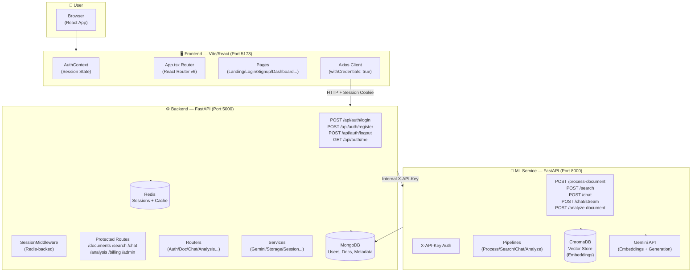
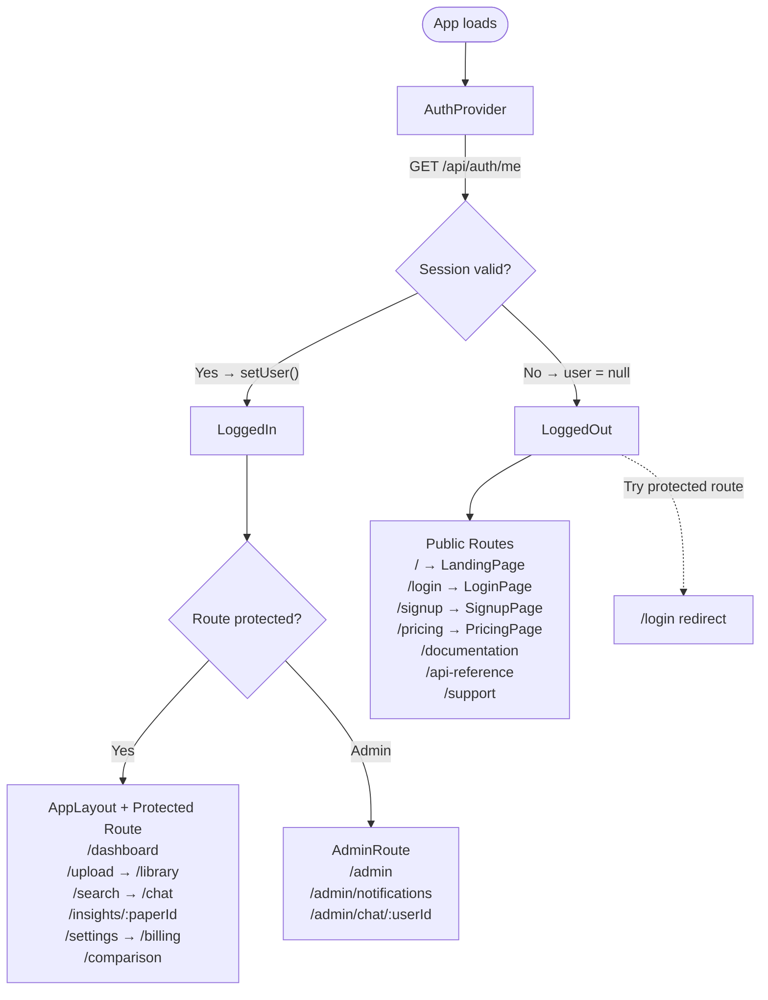
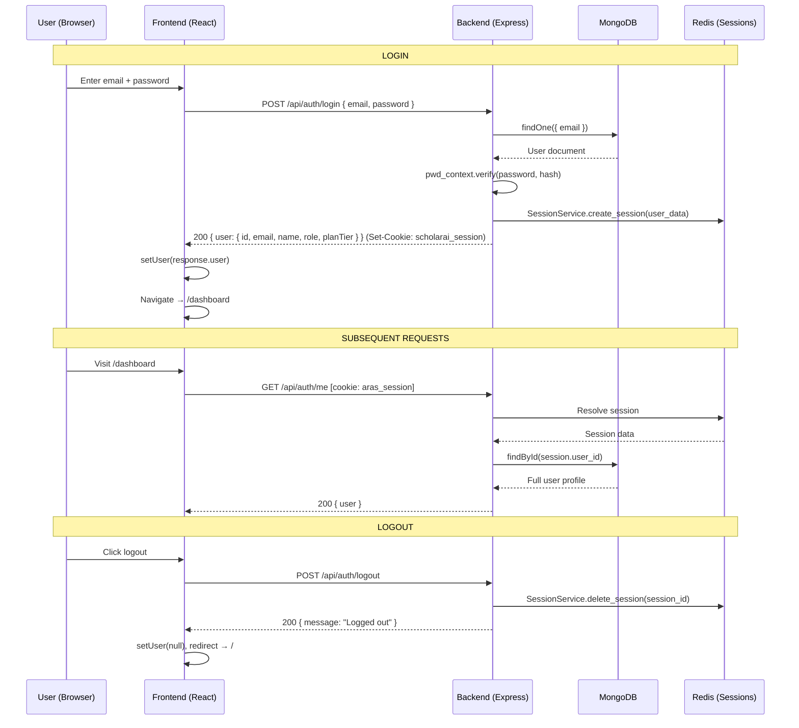
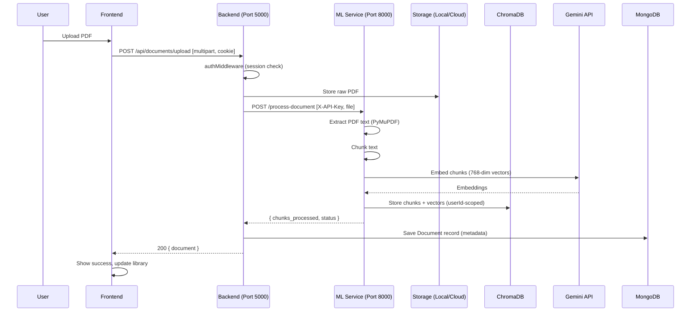
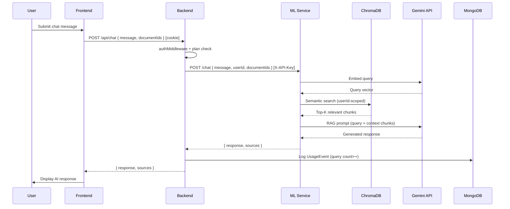

# ScholarAI System Flow

## Architecture Overview

---

## 1. Frontend Routing Flow

---

## 2. Authentication Flow

---

## 3. Document Upload & Processing Flow

---

## 4. RAG Chat / Search Flow

---

## 5. Backend API Route Map

| Route | Auth | Rate Limiter | Handler |
|-------|------|-------------|---------|
| `GET  /api/health` | ❌ Public | None | healthRoutes |
| `GET  /api/docs` | ❌ Public | None | docsController |
| `POST /api/auth/login` | ❌ Public | authLimiter (20/5min) | authController.login |
| `POST /api/auth/register` | ❌ Public | authLimiter | authController.register |
| `POST /api/auth/logout` | ❌ Public | authLimiter | authController.logout |
| `GET  /api/auth/me` | ✅ Session | authLimiter | authController.getProfile |
| `*    /api/documents/*` | ✅ Session | — | documentController |
| `*    /api/search/*` | ✅ Session | — | searchController |
| `*    /api/analysis/*` | ✅ Session | — | analysisController |
| `*    /api/chat/*` | ✅ Session | — | chatController |
| `*    /api/admin/*` | ✅ Session + adminRole | — | adminController |
| `*    /api/support/*` | ✅ Session | — | supportChatController |
| `*    /api/upgrade/*` | ✅ Session | — | upgradeController |
| `*    /api/billing/*` | ✅ Session | — | billingController |
| `*    /api/keys/*` | ✅ Session | — | apiKeyController |

---

## 6. ML Service Route Map

| Route | Auth | Description |
|-------|------|-------------|
| `GET  /health` | ❌ Public | Health check |
| `POST /process-document` | ✅ X-API-Key | PDF → chunks → embed → ChromaDB |
| `POST /search` | ✅ X-API-Key | Semantic similarity search |
| `POST /chat` | ✅ X-API-Key | Standard RAG response |
| `POST /chat/stream` | ✅ X-API-Key | Streaming SSE RAG response |
| `POST /analyze-document` | ✅ X-API-Key | Gemini structured analysis |

---

## 7. Rate Limiting Strategy

| Limiter | Window | Limit (by Plan) | Applied To |
|---------|--------|-----------------|-----------|
| `authLimiter` | 5 min | 20 req | Login/Register/Logout |
| `userApiLimiter` | 1 min | FREE=15, BASIC=30, STD=50, PRO=100 | All user APIs |
| `adminApiLimiter` | 60 min | 50 req | Admin routes |
| `aiHeavyLimiter` | 15 min | PRO=50, others=5 | Heavy AI ops |

> **Note:** All rate limiters use Redis (distributed). All are **skipped in development** (`NODE_ENV !== 'production'`).

---

## 8. Data Models Summary

| Model | Key Fields | Purpose |
|-------|-----------|---------|
| `User` | email, password (bcrypt), role, planTier, subscriptionStatus | Identity + billing tier |
| `Document` | userId, filename, status, chunkCount | PDF metadata |
| `DocumentChunk` | documentId, userId, text, embedding | Vector chunks |
| `ChatMessage` | userId, documentIds, role, content | Chat history |
| `Subscription` | userId, plan, status, renewalDate | Plan management |
| `UsageEvent` | userId, type (upload/query), timestamp | Metered billing |
| `ApiKey` | userId, key (hashed), plan, rateLimit | External API access |
| `AuditLog` | userId, action, resource, timestamp | Admin audit trail |
| `AdminChat` | adminId, userId, messages | Admin↔User messaging |
| `UpgradeRequest` | userId, currentPlan, requestedPlan | Upgrade workflow |

---

## 9. Seeded Users (Auto-created on Startup)

| Name | Email | Role | Plan |
|------|-------|------|------|
| Godfrey Admin | godfrey.cs23@krct.ac.in | admin | PRO |
| Hari Prakash | hariprakash@scholarai.ai | user | PRO |
| Oppo User | oppo@aras.ai | user | BASIC |
| Grish | grish@aras.ai | user | STANDARD |

> Default password for all seeded users: `Password123`

---

## 10. Key Integration Points & Potential Issues

> [!WARNING]
> **`/api/auth/profile` (PUT) is missing from `authRoutes.ts`** — the frontend `authService.updateProfile()` calls `PUT /auth/profile` but no such route is registered. This will result in a 404.

> [!WARNING]
> **`authRoutes.ts` has `/register` & `/login`** as direct session-based routes. The previous Firebase-based `verify-firebase` endpoint has been fully removed — this is consistent.

> [!NOTE]
> **Rate limiters depend on Redis** (`config/redis`). If Redis is unavailable, the in-memory fallback is used but rate limiting becomes non-distributed.

> [!NOTE]
> **ML Service authentication**: The backend passes `ML_SERVICE_API_KEY` via `X-API-Key` header to the ML service. The ML service will skip auth entirely if `ML_SERVICE_API_KEY` is not set (dev mode).

> [!TIP]
> **Session cookie name is `aras_session`** (configured in `settings.py`). The client uses `withCredentials: true` for all Axios requests, ensuring cookies flow correctly across the Vite dev proxy.
