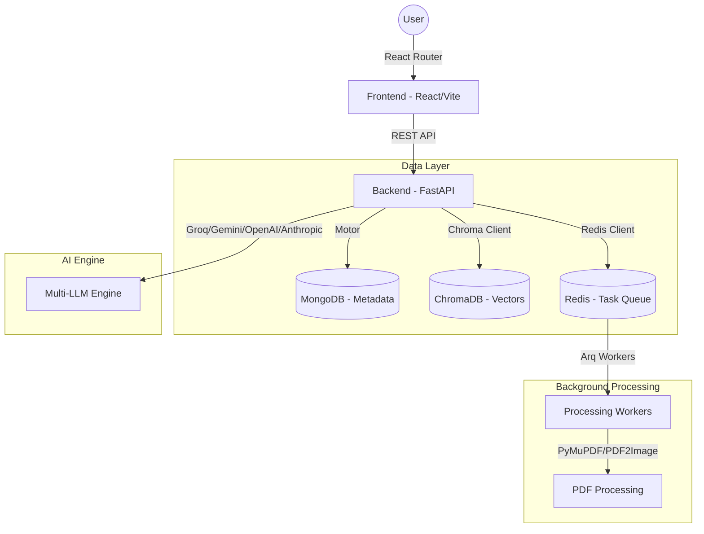

# ScholarAI - Advanced Research Analysis System

ScholarAI is a high-performance, open-access academic and business intelligence research platform. It leverages state-of-the-art AI models and RAG (Retrieval-Augmented Generation) to provide deep insights into research documents.

---

### 1. System Architecture Overview

The system follows a modern decoupled Client-Server architecture designed for scalability and "Open Access" availability.

#### **High-Level Architecture Diagram**

---

### 2. Technology Stack

#### **Frontend (UI/UX)**
- **Framework:** React 19 with Vite (TypeScript)
- **Styling:** Tailwind CSS v4 (Next-Gen utility-first engine)
- **State Management:** Zustand (Client-side), TanStack React Query (Server-side)
- **Animations:** Framer Motion & Motion (for premium, fluid interactions)
- **Icons:** Lucide React
- **Notifications:** Sonner
- **Form Handling:** React Hook Form + Zod

#### **Backend (API & Logic)**
- **Framework:** FastAPI (Python 3.10+)
- **Server:** Uvicorn (ASGI)
- **Database (NoSQL):** MongoDB (via Motor for async support)
- **Vector Store:** ChromaDB (local/persistent storage for document embeddings)
- **Task Queue:** Redis + Arq (for async PDF ingestion and embedding generation)
- **PDF Processing:** PyMuPDF (Fitz), PyPDF, PDF2Image, Tesseract OCR
- **Logging:** Structured logging with `structlog`

#### **AI & LLM Integration**
- **Multi-Provider Support:** Groq (High-speed inference), Google Gemini (Large context), OpenAI (GPT-4), Anthropic (Claude).
- **Embeddings:** Dual-mode support (Local via HuggingFace or Remote via Gemini).

---

### 3. Core Functional Modules

#### **A. Research Library (`/library`)**
- Centralized management of research documents.
- Support for grid/list views with advanced filtering.
- Bulk actions: Multi-document selection for comparative analysis.
- Real-time processing status indicators for document ingestion.

#### **B. Intelligent Chat (`/chat`)**
- Context-aware RAG system.
- Allows users to query specific documents or the entire library.
- Multi-LLM switching capability for different analysis needs.
- Markdown rendering with syntax highlighting for technical content.

#### **C. Comparative Insights (`/compare`)**
- Side-by-side analysis of multiple research papers.
- Automatic extraction of key metrics, methodologies, and findings.
- Visual data representation using Recharts.

#### **D. Semantic Search (`/search`)**
- Goes beyond keyword matching using vector embeddings.
- Retrieves relevant sections from the entire database based on conceptual similarity.

#### **E. Document Analytics (`/analytics/:id`)**
- Automated summary generation.
- Key entity extraction (authors, institutions, keywords).
- Trend analysis and citation mapping (where available).

---

### 4. System Logic & Data Flow

1.  **Ingestion Flow:**
    - User uploads PDF -> Backend stores file and metadata in MongoDB.
    - Worker process is triggered via Redis/Arq.
    - PDF is parsed, chunked, and converted into vector embeddings.
    - Vectors are stored in ChromaDB for future retrieval.

2.  **Query Flow (RAG):**
    - User sends a message in Chat.
    - Backend converts query to vector embedding.
    - ChromaDB finds most relevant document chunks.
    - Chunks + User Message are sent to the selected LLM (Groq/Gemini).
    - LLM generates response based *only* on provided context.

---

### 5. Security & Availability
- **Open Access:** The system has been refactored to eliminate session/authentication gating, making research tools globally accessible without barriers.
- **Environment Driven:** Configuration managed via `.env` files for both frontend and backend.

---

### 6. Development & Maintenance
- **Startup:** Managed via `start.bat` (Windows) or `start.sh` (Linux).
- **Build System:** Vite for optimized frontend assets.
- **Testing:** Pytest suite for backend validation.
